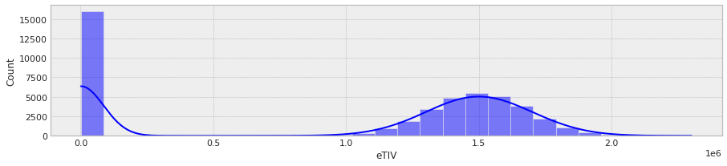
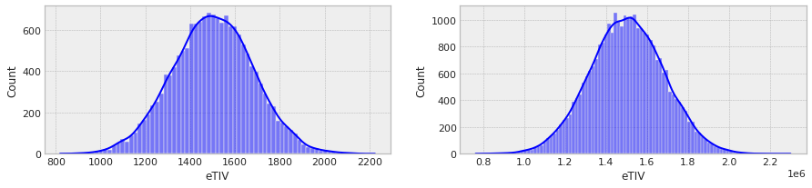

# What are quality datasets

Quality datasets have the following properties:

1. **Data-Type Constraints**: all column values assigned the correct datatype, i.e., binary, categorical, ordinal, numeric, date
1. **Mandatory Columns**: some columns cannot be empty.
1. **Range Constraints**: numeric or dates columns should fall within a certain domain range.
1. **Categorical Consistency**: Categorical columns have a set of unique values For example, a person’s sex may be male or female.
1. **Cross-Column Consistency**: There are some interactions that need to make sense (e.g. age in years should be assoicated to birth date)
1. **Uniformity Constraints**: The degree to which the data is specified using the same unit of measure.


## What is Data Preprocessing ?
The process of data preprocessing involves converting raw data into a format that can be analyzed and used. Data from the real world tends to be incomplete, inconsistent, and/or lacking in certain behaviors and trends, as well as containing a lot of errors. This can be resolved through data cleaning.
Furthermore, when you have access to a large dataset with several potential interactions, you may wish to isolate a question of interest, doing so from the beginning will help you focus on what is most important at that time with the flexibility to always go back and incorporate the features or domains you excluded earlier.

## Why use Data Preprocessing?
In the real world, data often contain inaccuracies, noise, and inconsistencies. 
- When an observation is incomplete, we mean that it lacks attribute values, lacks desired attributes, or is only aggregated.
- When there are errors or outliers in the data, they are considered noisy. 
- Data that is inconsistent contains names or codes that aren't consistent with the structure of interest.

## What can I do when an observations are incomplete?
- If the dataset is large enough..., exclude all observations with missing values
- You might consider imputed values in rare datasets (even if they are large)
- Decide in advance (before you examine the dataset) some exclusion criteria 
 
## What can I do when there are errors or outliers in the data?
- First task is to identify errors or outliers cases 
  - Errors are values that were logged incorrectly 
  - Outliers are values that can't be justified conceptually (i.e. using a domain expert)
- Once you find them, you need to come up with a strategy
  - In order to eliminate errors and outliers, we can filter data
  - Outliers and errors can be transformed or imputed
  - They can be investigated independently 

## What can I do when my dataset is inconsistent?
It depends on the level of inconsistency? 
  - Sometimes it's all about simple hacks 
  - Sometimes you need some manual procedures 
    - In manuals, it is crucial to identify problems 
      - Understand them
      - Handle them 
      
# Using simulation to understand the data cleaning cycle

## Why simulate fake data?
There are two reasons for this:
1. In this tutorial, you will learn how to simulate data in Python
1. Create these problems explicitly to better understand them 

## How to simulate messy data 
- We will simulate Intra Cranial Volume (also known as estimated Total Intracranial  Volume (eTIV) in 50k males and females
- In addition, we will simulate CDR for all of these humans
- Currently (this week), we are only generating these three values without imposing any effect (i.e. sex, eTIV & CDR)
- What we do is to create datasets with different types of problems
- The goal of this session is to fix the data (and remove rows that cannot be fixed).

## Start by importing different tools


```python
from datetime import datetime
CURRENT_TIME = datetime.now().strftime("%d-%m-%y_%H:%M")
AUTHOR = 'ES'

from IPython.display import display, Markdown,Latex,HTML
import numpy as np
import pandas as pd
import seaborn as sns
import matplotlib.pyplot as plt
import zipfile
from pathlib import Path

sns.set()

%matplotlib inline
%load_ext autoreload
%autoreload 2
plt.style.use('bmh')
```


## Assign a seed so we all have the same values
As you recall, this is how we create a random value generator 


```python
rng = np.random.default_rng(seed = 2021)
n = 50000
```

## We will start with the CDR values 

### [CDR® Dementia Staging Instrument](https://knightadrc.wustl.edu/cdr/cdr.htm)

The CDR® Dementia Staging Instrument in one aspect is a 5-point scale used to characterize six domains of cognitive and functional performance applicable to Alzheimer disease and related dementias: Memory, Orientation, Judgment & Problem Solving, Community Affairs, Home & Hobbies, and Personal Care. The necessary information to make each rating is obtained through a semi-structured interview of the patient and a reliable informant or collateral source (e.g., family member) referred to as the CDR® Assessment Protocol.


### Using the following probabilities, sample five groups 

Seventy-five percent of the population needs to be healthy.  
Probabilities for the rest are smaller.  
Additionally, we want to introduce missing values that represent incomplete observations.  
And add errors and outliers to the code.  

To begin with, here are some sampling probability with matching values

| Value | Probability | CDR context |
| :------------ | :------------ | :---- |
|  0 | 0.75 | Normal |
|  0.5 | 0.05 | Very Mild Dementia |
| 1  | 0.04 | Mild Dementia |
| 2 | 0.04 | Moderate Dementia|
|3 | 0.02 | Severe Dementia |
|np.nan| 0.06 | Missing values|
| `3 ` | 0.015 | error in coding |
| ` ` | 0.015 | error in coding | 
| `99` | 0.01 | Missing values|

you should use ['numpy.random.Generator.choice'](https://numpy.org/doc/stable/reference/random/generated/numpy.random.Generator.choice.html).  
You may, however, challenge yourself by thinking of a way in which you would use a uniform distribution and a loop instead. 


```python
p = [0.75,0.05,0.04,0.04,0.02,0.06,0.015,0.015,0.01]
CDR = rng.choice([0,0.5,1,2,3,np.nan,'3 ',' ','99'],replace=True, size=(n,),p=p)
```

We take 20% of severe dementia cases and randomly assign them a value of 30 by introducing a coding error 


```python
ix = np.where(CDR=='3')[0]
rng.shuffle(ix)
CDR[ix[0:int(ix.shape[0]*0.2)]]= 30
```

Now we can apply the same concept to the continuous measure of [estimated Total Intracranial Volume](https://surfer.nmr.mgh.harvard.edu/fswiki/eTIV). 
We start by sampling 50k samples from a normal distribution (using the [numpy.random.Generator.normal](https://numpy.org/doc/stable/reference/random/generated/numpy.random.Generator.normal.html) generator) we define our normal distribution centered around a mean volume of 1.5e6 mm^3 and with 1.8e5 mm^3 width or standard deviation. 
Then we randomly sample 9% of observations and remove them by replacing their values with `np.nan` using [numpy.random.Generator.integers](https://numpy.org/doc/stable/reference/random/generated/numpy.random.Generator.integers.html).


```python
eTIV = rng.normal(1.5e6,1.8e5,size=(n,))
eTIV[rng.integers(low=0,high=n-1,size=(int(n*0.09),))] = np.nan
```

Making life interesting and introducing another form of error (and some other ways to randomly sample in Python). We are introducing a systematic inconsistency in the data where 32% of observations were coded using cm^3 instead of mm^3


```python
ix = rng.permuted(np.where(~np.isnan(eTIV)))[0,0:int(n*0.32)]
eTIV[ix] = eTIV[ix]*0.001 # tranfrom 32% of the data from mm^3 to cm^3
```

It is now possible to create a categorical sex variable and introduce different coding errors for this binary value (which are less common than you might think).


```python
p = [0.12,0.4,0.22,0.10,0.10,0.04,0.02]
sex = rng.choice(['M','m ',' F','f','f ',np.nan,' ?'],replace=True, size=(n,),p=p)
```

Keeping with the former systematic inconsistency, sex values from this site will be numerically coded.


```python
_sex = sex[ix]
for k in np.unique(_sex):
  _k = k.lower().strip()
  v = 1 if _k =='m' else 2 if _k=='f' else 'null'
  _sex[_sex==k] = v
sex[ix] = _sex
```

Finally, we will create a dataframe from this horrific sample


```python
fake_data = pd.DataFrame({'Sex':sex,'eTIV':eTIV,'CDR':CDR})
```

## It makes sense to put all of this inside a function


```python
def create_fake_data(n=50000,seed = 2021):
  rng = np.random.default_rng(seed = seed)
  
  p = [0.75,0.05,0.04,0.04,0.02,0.06,0.015,0.015,0.01]
  CDR = rng.choice([0,0.5,1,2,3,np.nan,'3 ',' ','99'],replace=True, size=(n,),p=p)
  ix = np.where(CDR=='3')[0]
  rng.shuffle(ix)
  CDR[ix[0:int(ix.shape[0]*0.2)]]= 30
  
  eTIV = rng.normal(1.5e6,1.8e5,size=(n,))
  eTIV[rng.integers(low=0,high=n-1,size=(int(n*0.09),))] = np.nan
  ix = rng.permuted(np.where(~np.isnan(eTIV)))[0,0:int(n*0.32)]
  eTIV[ix] = eTIV[ix]*0.001 # tranfrom 32% of the data from mm^3 to cm^3
  
  p = [0.12,0.4,0.22,0.10,0.10,0.04,0.02]
  sex = rng.choice(['M','m ',' F','f','f ',np.nan,' ?'],replace=True, size=(n,),p=p)
  _sex = sex[ix]
  for k in np.unique(_sex):
    _k = k.lower().strip()
    v = 1 if _k =='m' else 2 if _k=='f' else 'null'
    _sex[_sex==k] = v
  sex[ix] = _sex
  
  return pd.DataFrame({'Sex':sex,'eTIV':eTIV,'CDR':CDR})
```

# Examining data when you first get it 
We can use the describe function, but this function treats non-numeric values differently, so it may not be the best choice for examining raw messy data.


```python
fake_data.describe(include='all').T
```


<div>
<style scoped>
    .dataframe tbody tr th:only-of-type {
        vertical-align: middle;
    }

    .dataframe tbody tr th {
        vertical-align: top;
    }

    .dataframe thead th {
        text-align: right;
    }
</style>
<table border="1" class="dataframe">
  <thead>
    <tr style="text-align: right;">
      <th></th>
      <th>count</th>
      <th>unique</th>
      <th>top</th>
      <th>freq</th>
      <th>mean</th>
      <th>std</th>
      <th>min</th>
      <th>25%</th>
      <th>50%</th>
      <th>75%</th>
      <th>max</th>
    </tr>
  </thead>
  <tbody>
    <tr>
      <th>Sex</th>
      <td>50000</td>
      <td>10</td>
      <td>m</td>
      <td>13573</td>
      <td>NaN</td>
      <td>NaN</td>
      <td>NaN</td>
      <td>NaN</td>
      <td>NaN</td>
      <td>NaN</td>
      <td>NaN</td>
    </tr>
    <tr>
      <th>eTIV</th>
      <td>45715.0</td>
      <td>NaN</td>
      <td>NaN</td>
      <td>NaN</td>
      <td>976315.884756</td>
      <td>730096.606469</td>
      <td>819.082659</td>
      <td>1605.010384</td>
      <td>1368454.251519</td>
      <td>1554031.793032</td>
      <td>2300893.035496</td>
    </tr>
    <tr>
      <th>CDR</th>
      <td>50000</td>
      <td>10</td>
      <td>0</td>
      <td>37535</td>
      <td>NaN</td>
      <td>NaN</td>
      <td>NaN</td>
      <td>NaN</td>
      <td>NaN</td>
      <td>NaN</td>
      <td>NaN</td>
    </tr>
  </tbody>
</table>
</div>


This is a perfect example of how describe() will fail miserably. The reason is not that it isn't useful, but rather that it isn't designed for dealing with datasets  like these.

To solve the problems, it would be better if we created a function that mapped each problem and made it easier to fix each column separately.


```python
def missing_profile(x):
  d = {} 
  d[('obs', 'notnull')] = x.notnull().sum()
  d[('obs', 'isnull')] = x.isnull().sum()
  d[('%','missing')] = d[('obs', 'isnull')]/x.shape[0]
  index = pd.MultiIndex.from_tuples(d.keys())
  return pd.Series(d, index=index)
```


```python
fake_data.apply(missing_profile)
```


<div>
<style scoped>
    .dataframe tbody tr th:only-of-type {
        vertical-align: middle;
    }

    .dataframe tbody tr th {
        vertical-align: top;
    }

    .dataframe thead th {
        text-align: right;
    }
</style>
<table border="1" class="dataframe">
  <thead>
    <tr style="text-align: right;">
      <th></th>
      <th></th>
      <th>Sex</th>
      <th>eTIV</th>
      <th>CDR</th>
    </tr>
  </thead>
  <tbody>
    <tr>
      <th rowspan="2" valign="top">obs</th>
      <th>notnull</th>
      <td>50000.0</td>
      <td>45715.0000</td>
      <td>50000.0</td>
    </tr>
    <tr>
      <th>isnull</th>
      <td>0.0</td>
      <td>4285.0000</td>
      <td>0.0</td>
    </tr>
    <tr>
      <th>%</th>
      <th>missing</th>
      <td>0.0</td>
      <td>0.0857</td>
      <td>0.0</td>
    </tr>
  </tbody>
</table>
</div>


## This should raise alarms 
Even if we didn't make this data, I've never seen a raw dataset that was error-free 
The profile of the underlying distributions needs to be examined in any new dataset
Although we can definitely do this with prebuilt functions, making your own will allow you to learn and customize to the specifics of your dataset.


```python
def freq_profile(df):
  d = []
  for x in df: 
    if df[x].dtype==np.dtype(float):
      vc = df[x].value_counts(bins=5).sort_index().reset_index()
      if df[x].isnull().sum()>0:
        vc = pd.concat([vc,pd.DataFrame({'index':np.nan,
                                         x:df[x].isnull().sum()}
                                         ,index=[vc.shape[0]])],axis=0)
    else:
      vc = df[x].value_counts(dropna=False).sort_index().reset_index()
    vc.columns=['Value','Freq']
    vc['Precent']= vc.Freq/df.shape[0]
    d.append(pd.concat([vc.set_index('Value')], keys=[x], names=['Column']))
  return pd.concat(d)
```


```python
freq_profile(fake_data)
```


<div>
<style scoped>
    .dataframe tbody tr th:only-of-type {
        vertical-align: middle;
    }

    .dataframe tbody tr th {
        vertical-align: top;
    }

    .dataframe thead th {
        text-align: right;
    }
</style>
<table border="1" class="dataframe">
  <thead>
    <tr style="text-align: right;">
      <th></th>
      <th></th>
      <th>Freq</th>
      <th>Precent</th>
    </tr>
    <tr>
      <th>Column</th>
      <th>Value</th>
      <th></th>
      <th></th>
    </tr>
  </thead>
  <tbody>
    <tr>
      <th rowspan="10" valign="top">Sex</th>
      <th>?</th>
      <td>674</td>
      <td>0.01348</td>
    </tr>
    <tr>
      <th>F</th>
      <td>7578</td>
      <td>0.15156</td>
    </tr>
    <tr>
      <th>1</th>
      <td>8445</td>
      <td>0.16890</td>
    </tr>
    <tr>
      <th>2</th>
      <td>6603</td>
      <td>0.13206</td>
    </tr>
    <tr>
      <th>M</th>
      <td>4042</td>
      <td>0.08084</td>
    </tr>
    <tr>
      <th>f</th>
      <td>3381</td>
      <td>0.06762</td>
    </tr>
    <tr>
      <th>f</th>
      <td>3392</td>
      <td>0.06784</td>
    </tr>
    <tr>
      <th>m</th>
      <td>13573</td>
      <td>0.27146</td>
    </tr>
    <tr>
      <th>nan</th>
      <td>1360</td>
      <td>0.02720</td>
    </tr>
    <tr>
      <th>null</th>
      <td>952</td>
      <td>0.01904</td>
    </tr>
    <tr>
      <th rowspan="6" valign="top">eTIV</th>
      <th>(-1480.992, 460833.873]</th>
      <td>16000</td>
      <td>0.32000</td>
    </tr>
    <tr>
      <th>(460833.873, 920848.664]</th>
      <td>25</td>
      <td>0.00050</td>
    </tr>
    <tr>
      <th>(920848.664, 1380863.454]</th>
      <td>7508</td>
      <td>0.15016</td>
    </tr>
    <tr>
      <th>(1380863.454, 1840878.245]</th>
      <td>21285</td>
      <td>0.42570</td>
    </tr>
    <tr>
      <th>(1840878.245, 2300893.035]</th>
      <td>897</td>
      <td>0.01794</td>
    </tr>
    <tr>
      <th>NaN</th>
      <td>4285</td>
      <td>0.08570</td>
    </tr>
    <tr>
      <th rowspan="10" valign="top">CDR</th>
      <th></th>
      <td>742</td>
      <td>0.01484</td>
    </tr>
    <tr>
      <th>0</th>
      <td>37535</td>
      <td>0.75070</td>
    </tr>
    <tr>
      <th>0.5</th>
      <td>2467</td>
      <td>0.04934</td>
    </tr>
    <tr>
      <th>1</th>
      <td>1984</td>
      <td>0.03968</td>
    </tr>
    <tr>
      <th>2</th>
      <td>2022</td>
      <td>0.04044</td>
    </tr>
    <tr>
      <th>3</th>
      <td>797</td>
      <td>0.01594</td>
    </tr>
    <tr>
      <th>3</th>
      <td>780</td>
      <td>0.01560</td>
    </tr>
    <tr>
      <th>30</th>
      <td>199</td>
      <td>0.00398</td>
    </tr>
    <tr>
      <th>99</th>
      <td>475</td>
      <td>0.00950</td>
    </tr>
    <tr>
      <th>nan</th>
      <td>2999</td>
      <td>0.05998</td>
    </tr>
  </tbody>
</table>
</div>


# It's now time for everything to be fixed transparently 
It is obvious that this simulates a very problematic dataset. When we encounter something like this in real life, two things are essential: 
- Fix it in a non-destructive manner 
- Explain each step you take 

## Start by saving the pandas source file in your folder under raw data
- I assume that your notebook is in a notebook folder 
- Additionally, I assume that there is a data folder on the same level as the notebook folder
- And that the Data folder contains subfolders 
- This can be confirmed with ls 


```python
ls ../Data
```

    csv/  pkl/  zip/


## Pandas output formats 
- Pandas can obiously write out data using different [writer functions](https://pandas.pydata.org/pandas-docs/stable/user_guide/io.html). 
- Here are the two ones we will use during the course:

| Type | Data Description | Reader | Writer |
| ---- |  ---- | ---- | ---- |
|text | CSV | read_csv() | to_csv()|
|binary | Python Pickle Format | read_pickle() | to_pickle()|

- Here is how we can save our fake data


```python
fake_data.to_csv('../Data/csv/raw_fake_data.csv',index=False)
```

## Having learned how to fake data now we need to clean it
Fortunately, the eda table clearly identifies some problems (even if you do not possess prior knowledge). As a result, they are easy to fix (in fact, fixing them will be faster than learning how to create them).
A theoretical solution should be evident just by looking at the sex values  
`[ ?, F, 1, 2, M, f, f , m , nan, null]`
Although sometimes these can be automated, from my experience, this is never a good idea.
Instead we will use a powerful tool called regular expressions (press here for a [tutorial on regex](https://learn.datacamp.com/courses/regular-expressions-in-python))
In our example we are using some basic commands 
1. `^.*` search for everything from start to end containing: 
1. `[pattern]` string pattern inside brackets 
1. `[p1|p2|p3]` use `|` to define an `or` operator

Combined `Female`:`^.*[f|F|2]` this will search for strings containing 'f' or 'F' or 2 and replace them with the pattern `Female`


```python
sex_mapper = {'Female':'^.*[f|F|2]',
              'Male':'^.*[m|M|1]',
              np.nan:'^.*[null|nan|?]'}
fake_data.Sex = (fake_data.Sex.str.strip()
                 .replace(sex_mapper.values(),sex_mapper.keys(),
                          regex=True))
```

In other cases we want to ensure the numeric value of the data is restored. In this case a simple cain of replaces will do the trick. 


```python
fake_data.CDR = (fake_data.CDR.replace(r'^.*[99|nan|\s]',np.nan, regex=True)
                             .astype(float).replace(30,3))
```

The eTIV value is more difficult to spot from the eda table, but as a rule of thumb, float values should always be plotted as distributions before attempting to create rules for transformations.


```python
fig, ax = plt.subplots(figsize=(15,3))
sns.histplot(fake_data.eTIV,kde=True,ax=ax)
```


    <AxesSubplot:xlabel='eTIV', ylabel='Count'>


    

    


We can spot the two distributions using this rule for the `eTIV` column. Using a plot-driven heuristic, we should confirm...  


```python
fig, ax = plt.subplots(1,2,figsize=(15,3))
sns.histplot(fake_data.eTIV[fake_data.eTIV<0.5e6],kde=True,ax=ax[0])
sns.histplot(fake_data.eTIV[fake_data.eTIV>0.5e6],kde=True,ax=ax[1])
```


    <AxesSubplot:xlabel='eTIV', ylabel='Count'>


    

    


Which reveals the systematic inconsistency we introduced to the data. And fixing this is just a matter of transformation.   


```python
ix = fake_data.eTIV<0.5e6
fake_data.loc[ix,'eTIV'] = fake_data.eTIV[ix]*1000
```

All of this should be put into a function so that when we get more data from our messy colleagues, we can remember what we did and reapply it to the new data.


```python
def process_raw_data(input_path='../Data/csv/',input_name='fake_data',output_file=False):
  '''This function was written at <date> by <author> to clean dataset <name>
     Recived from <collaborator>. 
     Through a simple exploration of the data, we found some errors and inconsistencies.
     The following heuristics were used to fix them: 
      Binary categorical values were assigned to the sex column
      The CDR contained erroneous null labels and a systematic error that resulted
      in severe demented patients being classified as CDR outliers (v=30).
      The message has been forwarded to our collaborator, who will confirm it shortly. 
      eTIV showed two distributions: 
      one in standard mm*3 and another in what seems like  cm^3 values.
      We were able to salvage 30% of the data by scaling the observations with 
      scalar multiplication.
  '''
  df = pd.read_csv(f'{input_path}raw_{input_name}.csv')
  mapp = {'Female':'^.*[f|F|2]',
          'Male':'^.*[m|M|1]',
          np.nan:'^.*[null|nan|?]'}
  df.Sex = df.Sex.str.strip().replace(mapp.values(),mapp.keys(),regex=True).astype("category")
  df.CDR = (df.CDR.replace(r'^.*[99|nan|\s]',np.nan, regex=True)
                  .astype(float).replace(30,3))
  df.CDR = pd.Categorical(df.CDR,ordered=True)
  df.loc[df.eTIV<0.5e6,'eTIV'] = df.eTIV[df.eTIV<0.5e6]*1000
  if output_file:
     df.to_csv(f'{input_path}/cleaned_{input_name}.csv')
  return df
```


```python
df = process_raw_data(output_file=True)
```

After cleansing the data, examine the results to determine whether they are meaningful  


```python
df.apply(missing_profile)
```


<div>
<style scoped>
    .dataframe tbody tr th:only-of-type {
        vertical-align: middle;
    }

    .dataframe tbody tr th {
        vertical-align: top;
    }

    .dataframe thead th {
        text-align: right;
    }
</style>
<table border="1" class="dataframe">
  <thead>
    <tr style="text-align: right;">
      <th></th>
      <th></th>
      <th>Sex</th>
      <th>eTIV</th>
      <th>CDR</th>
    </tr>
  </thead>
  <tbody>
    <tr>
      <th rowspan="2" valign="top">obs</th>
      <th>notnull</th>
      <td>47014.00000</td>
      <td>45715.0000</td>
      <td>45004.00000</td>
    </tr>
    <tr>
      <th>isnull</th>
      <td>2986.00000</td>
      <td>4285.0000</td>
      <td>4996.00000</td>
    </tr>
    <tr>
      <th>%</th>
      <th>missing</th>
      <td>0.05972</td>
      <td>0.0857</td>
      <td>0.09992</td>
    </tr>
  </tbody>
</table>
</div>


```python
freq_profile(df)
```


<div>
<style scoped>
    .dataframe tbody tr th:only-of-type {
        vertical-align: middle;
    }

    .dataframe tbody tr th {
        vertical-align: top;
    }

    .dataframe thead th {
        text-align: right;
    }
</style>
<table border="1" class="dataframe">
  <thead>
    <tr style="text-align: right;">
      <th></th>
      <th></th>
      <th>Freq</th>
      <th>Precent</th>
    </tr>
    <tr>
      <th>Column</th>
      <th>Value</th>
      <th></th>
      <th></th>
    </tr>
  </thead>
  <tbody>
    <tr>
      <th rowspan="3" valign="top">Sex</th>
      <th>Female</th>
      <td>20954</td>
      <td>0.41908</td>
    </tr>
    <tr>
      <th>Male</th>
      <td>26060</td>
      <td>0.52120</td>
    </tr>
    <tr>
      <th>NaN</th>
      <td>2986</td>
      <td>0.05972</td>
    </tr>
    <tr>
      <th rowspan="6" valign="top">eTIV</th>
      <th>(760787.6359999999, 1070039.57]</th>
      <td>381</td>
      <td>0.00762</td>
    </tr>
    <tr>
      <th>(1070039.57, 1377752.937]</th>
      <td>10930</td>
      <td>0.21860</td>
    </tr>
    <tr>
      <th>(1377752.937, 1685466.303]</th>
      <td>27370</td>
      <td>0.54740</td>
    </tr>
    <tr>
      <th>(1685466.303, 1993179.669]</th>
      <td>6881</td>
      <td>0.13762</td>
    </tr>
    <tr>
      <th>(1993179.669, 2300893.035]</th>
      <td>153</td>
      <td>0.00306</td>
    </tr>
    <tr>
      <th>NaN</th>
      <td>4285</td>
      <td>0.08570</td>
    </tr>
    <tr>
      <th rowspan="6" valign="top">CDR</th>
      <th>0.0</th>
      <td>37535</td>
      <td>0.75070</td>
    </tr>
    <tr>
      <th>0.5</th>
      <td>2467</td>
      <td>0.04934</td>
    </tr>
    <tr>
      <th>1.0</th>
      <td>1984</td>
      <td>0.03968</td>
    </tr>
    <tr>
      <th>2.0</th>
      <td>2022</td>
      <td>0.04044</td>
    </tr>
    <tr>
      <th>3.0</th>
      <td>996</td>
      <td>0.01992</td>
    </tr>
    <tr>
      <th>NaN</th>
      <td>4996</td>
      <td>0.09992</td>
    </tr>
  </tbody>
</table>
</div>


# Final step (and in preparation to next week) create a pipeline

Once we are satisfied with the cleaning we applied, we should create a load_data function that looks for existing files and only reapplies the stage if we explicitly requested it. If not, it loads the file from disk.


```python
def load_data(stage='raw',input_path='../Data/csv/',input_name='fake_data',reapply=False):
  '''load_data will process data of f'{input_path}/{stage}_{input_name}.csv' if it exists or if reapply is True
  '''
  input_file = f'{input_path}/{stage}_{input_name}.csv'
  if not Path(input_file).exists() or reapply:
    df = {'raw':create_fake_data(),
          'processed':process_raw_data(input_path,input_name,True)}[stage]
  else:
    df = pd.read_csv(input_file)
  return df  
```


# Why is this important ?


```python
%%time
df = load_data('raw',reapply=True)
```

```python
%%time
df = load_data('processed',reapply=True)
```


```python
%%time
df = load_data('raw')
```


```python
%%time
df = load_data('processed')
```


## We finish our notebook with a pdf export to keep a "hard copy" of what we did 
```python
%%capture
%%bash -s "$CURRENT_TIME" "$AUTHOR"
mkdir -p pdf 
jupyter nbconvert --output pdf/How_to_clean_data_$1_$2.pdf --config cfg.py  How_to_clean_data.ipynb
```


# The plan for next week 

- To do the same procedure but for our real dataset
- To add an exclusion step in our load_data pipeline 


# An obvious exercise for those who wish to challenge themselves

Throughout the course, concrete examples of code will be shown and sometimes assignments will be given. Today's session includes two personal assignments (not mandatory):  
1. Build your own pipeline for the end-of-course dataset 
  - Load the data and profile it 
  - Identify potential issues 
  - Establish rules for dealing with them 
1. Build your own pipeline for your own rotation dataset 
  - What are the unique challenges your data presents? 
  - To adapt to these changes, how would you change the simple template introduced today? 


