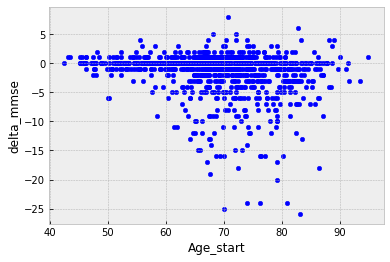

# Python For Data Science Cheat Sheet: Pandas Basics

## Introduction to Pandas

If Numpy is the central library for scientific computing in Python and Matplotlib is the primer (and the most complete)
data visualization, then Pandas lives in the middle and also builds on both libraries to support data manipulation
fundamental analysis and feature exploration.

Pandas data structures were created to make data analysis simpler. However, using it at first may feel intimidating.

## We start by importing pandas

- lets make sure pandas is working


```python
import numpy as np
import pandas as pd
import matplotlib.pyplot as plt
import sys
sys.path.append("../Code/")
import utils
%matplotlib inline
%load_ext autoreload
%autoreload 2
plt.style.use('bmh')
```

    The autoreload extension is already loaded. To reload it, use:
      %reload_ext autoreload


## Pandas Data Structures
- Series - A one-dimensional labeled array capable of holding any data type
- DataFrame - A two-dimensional labeled data structure with columns of potentially different types

## Creating Series
- You can create pandas series using any type of 1 dimensional vector 
- In this example the index of the Series will be genrated as integers starting at 0


```python
rng = np.random.default_rng(seed = 2021)
k = 50
series_1 = pd.Series(rng.integers(low=6, high=16, size=(k,)))
seq = [chr(x) for x in range(65, 70)]
p = [0.6,0.225,0.1,0.05,0.025]
index = rng.choice([chr(x) for x in range(65, 70)],replace=True, size=(k,),p=p)
series_2 = pd.Series(rng.integers(low=6, high=16, size=(k,)),index=index)
```

# We can stack multiple Series one over the other


```python
pd.concat([series_2,series_1])
```


    A      7
    B     15
    B     15
    A      9
    A      7
          ..
    45     7
    46    15
    47     7
    48     9
    49    10
    Length: 100, dtype: int64


## Or if they share a common index merge them into a DataFrame 


```python
df = pd.concat([series_2.reset_index(),series_1],axis=1)
```

## Creating Data frames

- A DataFrame is an object that stores data as rows and columns. You can think of a DataFrame as a spreadsheet or as a SQL table. You can manually create a DataFrame or fill it with data from a CSV, an Excel spreadsheet, or a SQL query.
- DataFrames have rows and columns. Each column has a name, which is a string. Each row has an index, which is an integer. DataFrames can contain many different data types: strings, ints, floats, tuples, etc.
- You can pass in a dictionary to pd.DataFrame(). Each key is a column name and each value is a list of column values. 

# We can look into the head or the tail of a dataframe


```python
display(df.head(5))
display(df.tail(5))
```


<div>
<style scoped>
    .dataframe tbody tr th:only-of-type {
        vertical-align: middle;
    }

    .dataframe tbody tr th {
        vertical-align: top;
    }

    .dataframe thead th {
        text-align: right;
    }
</style>
<table border="1" class="dataframe">
  <thead>
    <tr style="text-align: right;">
      <th></th>
      <th>index</th>
      <th>0</th>
      <th>0</th>
    </tr>
  </thead>
  <tbody>
    <tr>
      <th>0</th>
      <td>A</td>
      <td>7</td>
      <td>13</td>
    </tr>
    <tr>
      <th>1</th>
      <td>B</td>
      <td>15</td>
      <td>13</td>
    </tr>
    <tr>
      <th>2</th>
      <td>B</td>
      <td>15</td>
      <td>10</td>
    </tr>
    <tr>
      <th>3</th>
      <td>A</td>
      <td>9</td>
      <td>15</td>
    </tr>
    <tr>
      <th>4</th>
      <td>A</td>
      <td>7</td>
      <td>12</td>
    </tr>
  </tbody>
</table>
</div>


<div>
<style scoped>
    .dataframe tbody tr th:only-of-type {
        vertical-align: middle;
    }

    .dataframe tbody tr th {
        vertical-align: top;
    }

    .dataframe thead th {
        text-align: right;
    }
</style>
<table border="1" class="dataframe">
  <thead>
    <tr style="text-align: right;">
      <th></th>
      <th>index</th>
      <th>0</th>
      <th>0</th>
    </tr>
  </thead>
  <tbody>
    <tr>
      <th>45</th>
      <td>A</td>
      <td>11</td>
      <td>7</td>
    </tr>
    <tr>
      <th>46</th>
      <td>B</td>
      <td>14</td>
      <td>15</td>
    </tr>
    <tr>
      <th>47</th>
      <td>B</td>
      <td>8</td>
      <td>7</td>
    </tr>
    <tr>
      <th>48</th>
      <td>B</td>
      <td>8</td>
      <td>9</td>
    </tr>
    <tr>
      <th>49</th>
      <td>A</td>
      <td>12</td>
      <td>10</td>
    </tr>
  </tbody>
</table>
</div>


## And use descriptive statistics to describe the contents of the dataframe 


```python
display(df.describe())
```


<div>
<style scoped>
    .dataframe tbody tr th:only-of-type {
        vertical-align: middle;
    }

    .dataframe tbody tr th {
        vertical-align: top;
    }

    .dataframe thead th {
        text-align: right;
    }
</style>
<table border="1" class="dataframe">
  <thead>
    <tr style="text-align: right;">
      <th></th>
      <th>0</th>
      <th>0</th>
    </tr>
  </thead>
  <tbody>
    <tr>
      <th>count</th>
      <td>50.000000</td>
      <td>50.000000</td>
    </tr>
    <tr>
      <th>mean</th>
      <td>10.200000</td>
      <td>10.640000</td>
    </tr>
    <tr>
      <th>std</th>
      <td>2.913725</td>
      <td>3.015335</td>
    </tr>
    <tr>
      <th>min</th>
      <td>6.000000</td>
      <td>6.000000</td>
    </tr>
    <tr>
      <th>25%</th>
      <td>7.250000</td>
      <td>8.000000</td>
    </tr>
    <tr>
      <th>50%</th>
      <td>10.000000</td>
      <td>11.000000</td>
    </tr>
    <tr>
      <th>75%</th>
      <td>12.000000</td>
      <td>13.000000</td>
    </tr>
    <tr>
      <th>max</th>
      <td>15.000000</td>
      <td>15.000000</td>
    </tr>
  </tbody>
</table>
</div>


## let's download some real data to inspect 


```python
data = {}
for d in ["ADRCClinicalData",'FreeSurfers','SubDemos',"subjects"]:
  url = f'https://raw.githubusercontent.com/esoreq/Real_site/master/data/{d}.csv'
  data[d] = pd.read_csv(url)
  data[d].to_csv(f'../Data/csv/{d}.csv')
```

# We can display a Data frame just by calling it 


```python
data["subjects"]
```


<div>
<style scoped>
    .dataframe tbody tr th:only-of-type {
        vertical-align: middle;
    }

    .dataframe tbody tr th {
        vertical-align: top;
    }

    .dataframe thead th {
        text-align: right;
    }
</style>
<table border="1" class="dataframe">
  <thead>
    <tr style="text-align: right;">
      <th></th>
      <th>Subject</th>
      <th>M/F</th>
      <th>Hand</th>
      <th>YOB</th>
      <th>UDS A1: Sub Demos</th>
      <th>UDS B6: GDS</th>
      <th>UDS B8: Phys. Neuro Findings</th>
      <th>Psych Assessments</th>
      <th>UDS A2: Informant Demos</th>
      <th>UDS B7: FAQs</th>
      <th>UDS D1: Clinician Diagnosis</th>
      <th>UDS A5: Sub Health Hist.</th>
      <th>UDS B2: HIS and CVD</th>
      <th>UDS A3: Partcpt Family Hist.</th>
      <th>PETs</th>
      <th>UDS B3: UPDRS</th>
      <th>MR Sessions</th>
      <th>UDS B9: Clin. Judgements</th>
      <th>ADRC Clinical Data</th>
      <th>UDS B5: NPI-Q</th>
    </tr>
  </thead>
  <tbody>
    <tr>
      <th>0</th>
      <td>OAS30001</td>
      <td>F</td>
      <td>R</td>
      <td>NaN</td>
      <td>9.0</td>
      <td>9.0</td>
      <td>9.0</td>
      <td>9.0</td>
      <td>9.0</td>
      <td>9.0</td>
      <td>9.0</td>
      <td>9.0</td>
      <td>9.0</td>
      <td>9.0</td>
      <td>7.0</td>
      <td>9.0</td>
      <td>4</td>
      <td>9.0</td>
      <td>12</td>
      <td>9.0</td>
    </tr>
    <tr>
      <th>1</th>
      <td>OAS30002</td>
      <td>M</td>
      <td>R</td>
      <td>NaN</td>
      <td>8.0</td>
      <td>8.0</td>
      <td>8.0</td>
      <td>7.0</td>
      <td>8.0</td>
      <td>8.0</td>
      <td>8.0</td>
      <td>8.0</td>
      <td>8.0</td>
      <td>8.0</td>
      <td>3.0</td>
      <td>8.0</td>
      <td>4</td>
      <td>8.0</td>
      <td>8</td>
      <td>8.0</td>
    </tr>
    <tr>
      <th>2</th>
      <td>OAS30003</td>
      <td>F</td>
      <td>R</td>
      <td>NaN</td>
      <td>6.0</td>
      <td>6.0</td>
      <td>6.0</td>
      <td>NaN</td>
      <td>6.0</td>
      <td>6.0</td>
      <td>6.0</td>
      <td>6.0</td>
      <td>6.0</td>
      <td>6.0</td>
      <td>5.0</td>
      <td>6.0</td>
      <td>6</td>
      <td>6.0</td>
      <td>8</td>
      <td>6.0</td>
    </tr>
    <tr>
      <th>3</th>
      <td>OAS30004</td>
      <td>F</td>
      <td>L</td>
      <td>NaN</td>
      <td>3.0</td>
      <td>3.0</td>
      <td>3.0</td>
      <td>NaN</td>
      <td>3.0</td>
      <td>3.0</td>
      <td>3.0</td>
      <td>3.0</td>
      <td>3.0</td>
      <td>3.0</td>
      <td>4.0</td>
      <td>3.0</td>
      <td>4</td>
      <td>3.0</td>
      <td>4</td>
      <td>3.0</td>
    </tr>
    <tr>
      <th>4</th>
      <td>OAS30005</td>
      <td>F</td>
      <td>R</td>
      <td>NaN</td>
      <td>3.0</td>
      <td>3.0</td>
      <td>3.0</td>
      <td>NaN</td>
      <td>3.0</td>
      <td>3.0</td>
      <td>3.0</td>
      <td>3.0</td>
      <td>3.0</td>
      <td>3.0</td>
      <td>5.0</td>
      <td>3.0</td>
      <td>6</td>
      <td>3.0</td>
      <td>4</td>
      <td>3.0</td>
    </tr>
    <tr>
      <th>...</th>
      <td>...</td>
      <td>...</td>
      <td>...</td>
      <td>...</td>
      <td>...</td>
      <td>...</td>
      <td>...</td>
      <td>...</td>
      <td>...</td>
      <td>...</td>
      <td>...</td>
      <td>...</td>
      <td>...</td>
      <td>...</td>
      <td>...</td>
      <td>...</td>
      <td>...</td>
      <td>...</td>
      <td>...</td>
      <td>...</td>
    </tr>
    <tr>
      <th>1093</th>
      <td>OAS31168</td>
      <td>M</td>
      <td>R</td>
      <td>NaN</td>
      <td>7.0</td>
      <td>7.0</td>
      <td>7.0</td>
      <td>7.0</td>
      <td>7.0</td>
      <td>7.0</td>
      <td>7.0</td>
      <td>7.0</td>
      <td>7.0</td>
      <td>7.0</td>
      <td>4.0</td>
      <td>7.0</td>
      <td>3</td>
      <td>7.0</td>
      <td>9</td>
      <td>7.0</td>
    </tr>
    <tr>
      <th>1094</th>
      <td>OAS31169</td>
      <td>F</td>
      <td>R</td>
      <td>NaN</td>
      <td>2.0</td>
      <td>2.0</td>
      <td>2.0</td>
      <td>NaN</td>
      <td>2.0</td>
      <td>2.0</td>
      <td>2.0</td>
      <td>2.0</td>
      <td>2.0</td>
      <td>2.0</td>
      <td>NaN</td>
      <td>2.0</td>
      <td>1</td>
      <td>2.0</td>
      <td>3</td>
      <td>2.0</td>
    </tr>
    <tr>
      <th>1095</th>
      <td>OAS31170</td>
      <td>F</td>
      <td>R</td>
      <td>NaN</td>
      <td>5.0</td>
      <td>5.0</td>
      <td>5.0</td>
      <td>4.0</td>
      <td>5.0</td>
      <td>5.0</td>
      <td>5.0</td>
      <td>5.0</td>
      <td>5.0</td>
      <td>5.0</td>
      <td>NaN</td>
      <td>5.0</td>
      <td>1</td>
      <td>5.0</td>
      <td>7</td>
      <td>5.0</td>
    </tr>
    <tr>
      <th>1096</th>
      <td>OAS31171</td>
      <td>F</td>
      <td>R</td>
      <td>NaN</td>
      <td>3.0</td>
      <td>3.0</td>
      <td>3.0</td>
      <td>2.0</td>
      <td>3.0</td>
      <td>3.0</td>
      <td>3.0</td>
      <td>3.0</td>
      <td>3.0</td>
      <td>3.0</td>
      <td>1.0</td>
      <td>3.0</td>
      <td>1</td>
      <td>3.0</td>
      <td>4</td>
      <td>3.0</td>
    </tr>
    <tr>
      <th>1097</th>
      <td>OAS31172</td>
      <td>F</td>
      <td>L</td>
      <td>NaN</td>
      <td>6.0</td>
      <td>6.0</td>
      <td>6.0</td>
      <td>6.0</td>
      <td>6.0</td>
      <td>6.0</td>
      <td>6.0</td>
      <td>6.0</td>
      <td>6.0</td>
      <td>6.0</td>
      <td>1.0</td>
      <td>6.0</td>
      <td>2</td>
      <td>6.0</td>
      <td>8</td>
      <td>6.0</td>
    </tr>
  </tbody>
</table>
<p>1098 rows × 20 columns</p>
</div>


# And we can inspect it's properties by calling the method info()


```python
data["subjects"].info()
```

    <class 'pandas.core.frame.DataFrame'>
    RangeIndex: 1098 entries, 0 to 1097
    Data columns (total 20 columns):
     #   Column                        Non-Null Count  Dtype  
    ---  ------                        --------------  -----  
     0   Subject                       1098 non-null   object 
     1   M/F                           1098 non-null   object 
     2   Hand                          1098 non-null   object 
     3   YOB                           0 non-null      float64
     4   UDS A1: Sub Demos             1016 non-null   float64
     5   UDS B6: GDS                   1016 non-null   float64
     6   UDS B8: Phys. Neuro Findings  1016 non-null   float64
     7   Psych Assessments             810 non-null    float64
     8   UDS A2: Informant Demos       1016 non-null   float64
     9   UDS B7: FAQs                  1016 non-null   float64
     10  UDS D1: Clinician Diagnosis   1016 non-null   float64
     11  UDS A5: Sub Health Hist.      1016 non-null   float64
     12  UDS B2: HIS and CVD           1016 non-null   float64
     13  UDS A3: Partcpt Family Hist.  1016 non-null   float64
     14  PETs                          777 non-null    float64
     15  UDS B3: UPDRS                 1016 non-null   float64
     16  MR Sessions                   1098 non-null   int64  
     17  UDS B9: Clin. Judgements      1016 non-null   float64
     18  ADRC Clinical Data            1098 non-null   int64  
     19  UDS B5: NPI-Q                 1016 non-null   float64
    dtypes: float64(15), int64(2), object(3)
    memory usage: 171.7+ KB


## We will often select a subset of the data to examine 
- Using the iloc method we can extract either selected rows


```python
d1 = data["subjects"].iloc[4:20,:]
d1 
```


<div>
<style scoped>
    .dataframe tbody tr th:only-of-type {
        vertical-align: middle;
    }

    .dataframe tbody tr th {
        vertical-align: top;
    }

    .dataframe thead th {
        text-align: right;
    }
</style>
<table border="1" class="dataframe">
  <thead>
    <tr style="text-align: right;">
      <th></th>
      <th>Subject</th>
      <th>M/F</th>
      <th>Hand</th>
      <th>YOB</th>
      <th>UDS A1: Sub Demos</th>
      <th>UDS B6: GDS</th>
      <th>UDS B8: Phys. Neuro Findings</th>
      <th>Psych Assessments</th>
      <th>UDS A2: Informant Demos</th>
      <th>UDS B7: FAQs</th>
      <th>UDS D1: Clinician Diagnosis</th>
      <th>UDS A5: Sub Health Hist.</th>
      <th>UDS B2: HIS and CVD</th>
      <th>UDS A3: Partcpt Family Hist.</th>
      <th>PETs</th>
      <th>UDS B3: UPDRS</th>
      <th>MR Sessions</th>
      <th>UDS B9: Clin. Judgements</th>
      <th>ADRC Clinical Data</th>
      <th>UDS B5: NPI-Q</th>
    </tr>
  </thead>
  <tbody>
    <tr>
      <th>4</th>
      <td>OAS30005</td>
      <td>F</td>
      <td>R</td>
      <td>NaN</td>
      <td>3.0</td>
      <td>3.0</td>
      <td>3.0</td>
      <td>NaN</td>
      <td>3.0</td>
      <td>3.0</td>
      <td>3.0</td>
      <td>3.0</td>
      <td>3.0</td>
      <td>3.0</td>
      <td>5.0</td>
      <td>3.0</td>
      <td>6</td>
      <td>3.0</td>
      <td>4</td>
      <td>3.0</td>
    </tr>
    <tr>
      <th>5</th>
      <td>OAS30006</td>
      <td>M</td>
      <td>R</td>
      <td>NaN</td>
      <td>7.0</td>
      <td>7.0</td>
      <td>7.0</td>
      <td>NaN</td>
      <td>7.0</td>
      <td>7.0</td>
      <td>7.0</td>
      <td>7.0</td>
      <td>7.0</td>
      <td>7.0</td>
      <td>5.0</td>
      <td>7.0</td>
      <td>5</td>
      <td>7.0</td>
      <td>10</td>
      <td>7.0</td>
    </tr>
    <tr>
      <th>6</th>
      <td>OAS30007</td>
      <td>M</td>
      <td>R</td>
      <td>NaN</td>
      <td>7.0</td>
      <td>7.0</td>
      <td>7.0</td>
      <td>7.0</td>
      <td>7.0</td>
      <td>7.0</td>
      <td>7.0</td>
      <td>7.0</td>
      <td>7.0</td>
      <td>7.0</td>
      <td>5.0</td>
      <td>7.0</td>
      <td>5</td>
      <td>7.0</td>
      <td>9</td>
      <td>7.0</td>
    </tr>
    <tr>
      <th>7</th>
      <td>OAS30008</td>
      <td>F</td>
      <td>R</td>
      <td>NaN</td>
      <td>2.0</td>
      <td>2.0</td>
      <td>2.0</td>
      <td>NaN</td>
      <td>2.0</td>
      <td>2.0</td>
      <td>2.0</td>
      <td>2.0</td>
      <td>2.0</td>
      <td>2.0</td>
      <td>5.0</td>
      <td>2.0</td>
      <td>4</td>
      <td>2.0</td>
      <td>3</td>
      <td>2.0</td>
    </tr>
    <tr>
      <th>8</th>
      <td>OAS30009</td>
      <td>F</td>
      <td>R</td>
      <td>NaN</td>
      <td>3.0</td>
      <td>3.0</td>
      <td>3.0</td>
      <td>NaN</td>
      <td>3.0</td>
      <td>3.0</td>
      <td>3.0</td>
      <td>3.0</td>
      <td>3.0</td>
      <td>3.0</td>
      <td>3.0</td>
      <td>3.0</td>
      <td>3</td>
      <td>3.0</td>
      <td>3</td>
      <td>3.0</td>
    </tr>
    <tr>
      <th>9</th>
      <td>OAS30010</td>
      <td>F</td>
      <td>R</td>
      <td>NaN</td>
      <td>1.0</td>
      <td>1.0</td>
      <td>1.0</td>
      <td>1.0</td>
      <td>1.0</td>
      <td>1.0</td>
      <td>1.0</td>
      <td>1.0</td>
      <td>1.0</td>
      <td>1.0</td>
      <td>1.0</td>
      <td>1.0</td>
      <td>1</td>
      <td>1.0</td>
      <td>3</td>
      <td>1.0</td>
    </tr>
    <tr>
      <th>10</th>
      <td>OAS30011</td>
      <td>F</td>
      <td>R</td>
      <td>NaN</td>
      <td>4.0</td>
      <td>4.0</td>
      <td>4.0</td>
      <td>4.0</td>
      <td>4.0</td>
      <td>4.0</td>
      <td>4.0</td>
      <td>4.0</td>
      <td>4.0</td>
      <td>4.0</td>
      <td>2.0</td>
      <td>4.0</td>
      <td>2</td>
      <td>4.0</td>
      <td>5</td>
      <td>4.0</td>
    </tr>
    <tr>
      <th>11</th>
      <td>OAS30012</td>
      <td>M</td>
      <td>L</td>
      <td>NaN</td>
      <td>1.0</td>
      <td>1.0</td>
      <td>1.0</td>
      <td>NaN</td>
      <td>1.0</td>
      <td>1.0</td>
      <td>1.0</td>
      <td>1.0</td>
      <td>1.0</td>
      <td>1.0</td>
      <td>NaN</td>
      <td>1.0</td>
      <td>2</td>
      <td>1.0</td>
      <td>3</td>
      <td>1.0</td>
    </tr>
    <tr>
      <th>12</th>
      <td>OAS30013</td>
      <td>M</td>
      <td>R</td>
      <td>NaN</td>
      <td>2.0</td>
      <td>2.0</td>
      <td>2.0</td>
      <td>2.0</td>
      <td>2.0</td>
      <td>2.0</td>
      <td>2.0</td>
      <td>2.0</td>
      <td>2.0</td>
      <td>2.0</td>
      <td>1.0</td>
      <td>2.0</td>
      <td>1</td>
      <td>2.0</td>
      <td>4</td>
      <td>2.0</td>
    </tr>
    <tr>
      <th>13</th>
      <td>OAS30014</td>
      <td>F</td>
      <td>R</td>
      <td>NaN</td>
      <td>8.0</td>
      <td>8.0</td>
      <td>8.0</td>
      <td>7.0</td>
      <td>8.0</td>
      <td>8.0</td>
      <td>8.0</td>
      <td>8.0</td>
      <td>8.0</td>
      <td>8.0</td>
      <td>NaN</td>
      <td>8.0</td>
      <td>2</td>
      <td>8.0</td>
      <td>11</td>
      <td>8.0</td>
    </tr>
    <tr>
      <th>14</th>
      <td>OAS30015</td>
      <td>M</td>
      <td>R</td>
      <td>NaN</td>
      <td>8.0</td>
      <td>8.0</td>
      <td>8.0</td>
      <td>8.0</td>
      <td>8.0</td>
      <td>8.0</td>
      <td>8.0</td>
      <td>8.0</td>
      <td>8.0</td>
      <td>8.0</td>
      <td>3.0</td>
      <td>8.0</td>
      <td>4</td>
      <td>8.0</td>
      <td>11</td>
      <td>8.0</td>
    </tr>
    <tr>
      <th>15</th>
      <td>OAS30016</td>
      <td>M</td>
      <td>R</td>
      <td>NaN</td>
      <td>1.0</td>
      <td>1.0</td>
      <td>1.0</td>
      <td>1.0</td>
      <td>1.0</td>
      <td>1.0</td>
      <td>1.0</td>
      <td>1.0</td>
      <td>1.0</td>
      <td>1.0</td>
      <td>NaN</td>
      <td>1.0</td>
      <td>1</td>
      <td>1.0</td>
      <td>1</td>
      <td>1.0</td>
    </tr>
    <tr>
      <th>16</th>
      <td>OAS30017</td>
      <td>F</td>
      <td>A</td>
      <td>NaN</td>
      <td>2.0</td>
      <td>2.0</td>
      <td>2.0</td>
      <td>NaN</td>
      <td>2.0</td>
      <td>2.0</td>
      <td>2.0</td>
      <td>2.0</td>
      <td>2.0</td>
      <td>2.0</td>
      <td>1.0</td>
      <td>2.0</td>
      <td>1</td>
      <td>2.0</td>
      <td>2</td>
      <td>2.0</td>
    </tr>
    <tr>
      <th>17</th>
      <td>OAS30018</td>
      <td>M</td>
      <td>R</td>
      <td>NaN</td>
      <td>3.0</td>
      <td>3.0</td>
      <td>3.0</td>
      <td>3.0</td>
      <td>3.0</td>
      <td>3.0</td>
      <td>3.0</td>
      <td>3.0</td>
      <td>3.0</td>
      <td>3.0</td>
      <td>1.0</td>
      <td>3.0</td>
      <td>2</td>
      <td>3.0</td>
      <td>3</td>
      <td>3.0</td>
    </tr>
    <tr>
      <th>18</th>
      <td>OAS30019</td>
      <td>F</td>
      <td>R</td>
      <td>NaN</td>
      <td>3.0</td>
      <td>3.0</td>
      <td>3.0</td>
      <td>3.0</td>
      <td>3.0</td>
      <td>3.0</td>
      <td>3.0</td>
      <td>3.0</td>
      <td>3.0</td>
      <td>3.0</td>
      <td>NaN</td>
      <td>3.0</td>
      <td>1</td>
      <td>3.0</td>
      <td>3</td>
      <td>3.0</td>
    </tr>
    <tr>
      <th>19</th>
      <td>OAS30020</td>
      <td>F</td>
      <td>R</td>
      <td>NaN</td>
      <td>NaN</td>
      <td>NaN</td>
      <td>NaN</td>
      <td>NaN</td>
      <td>NaN</td>
      <td>NaN</td>
      <td>NaN</td>
      <td>NaN</td>
      <td>NaN</td>
      <td>NaN</td>
      <td>NaN</td>
      <td>NaN</td>
      <td>2</td>
      <td>NaN</td>
      <td>1</td>
      <td>NaN</td>
    </tr>
  </tbody>
</table>
</div>


## Or columns


```python
d2 = data["subjects"].iloc[:,[0,1,2,4,16,18]]
d2
```


<div>
<style scoped>
    .dataframe tbody tr th:only-of-type {
        vertical-align: middle;
    }

    .dataframe tbody tr th {
        vertical-align: top;
    }

    .dataframe thead th {
        text-align: right;
    }
</style>
<table border="1" class="dataframe">
  <thead>
    <tr style="text-align: right;">
      <th></th>
      <th>Subject</th>
      <th>M/F</th>
      <th>Hand</th>
      <th>UDS A1: Sub Demos</th>
      <th>MR Sessions</th>
      <th>ADRC Clinical Data</th>
    </tr>
  </thead>
  <tbody>
    <tr>
      <th>0</th>
      <td>OAS30001</td>
      <td>F</td>
      <td>R</td>
      <td>9.0</td>
      <td>4</td>
      <td>12</td>
    </tr>
    <tr>
      <th>1</th>
      <td>OAS30002</td>
      <td>M</td>
      <td>R</td>
      <td>8.0</td>
      <td>4</td>
      <td>8</td>
    </tr>
    <tr>
      <th>2</th>
      <td>OAS30003</td>
      <td>F</td>
      <td>R</td>
      <td>6.0</td>
      <td>6</td>
      <td>8</td>
    </tr>
    <tr>
      <th>3</th>
      <td>OAS30004</td>
      <td>F</td>
      <td>L</td>
      <td>3.0</td>
      <td>4</td>
      <td>4</td>
    </tr>
    <tr>
      <th>4</th>
      <td>OAS30005</td>
      <td>F</td>
      <td>R</td>
      <td>3.0</td>
      <td>6</td>
      <td>4</td>
    </tr>
    <tr>
      <th>...</th>
      <td>...</td>
      <td>...</td>
      <td>...</td>
      <td>...</td>
      <td>...</td>
      <td>...</td>
    </tr>
    <tr>
      <th>1093</th>
      <td>OAS31168</td>
      <td>M</td>
      <td>R</td>
      <td>7.0</td>
      <td>3</td>
      <td>9</td>
    </tr>
    <tr>
      <th>1094</th>
      <td>OAS31169</td>
      <td>F</td>
      <td>R</td>
      <td>2.0</td>
      <td>1</td>
      <td>3</td>
    </tr>
    <tr>
      <th>1095</th>
      <td>OAS31170</td>
      <td>F</td>
      <td>R</td>
      <td>5.0</td>
      <td>1</td>
      <td>7</td>
    </tr>
    <tr>
      <th>1096</th>
      <td>OAS31171</td>
      <td>F</td>
      <td>R</td>
      <td>3.0</td>
      <td>1</td>
      <td>4</td>
    </tr>
    <tr>
      <th>1097</th>
      <td>OAS31172</td>
      <td>F</td>
      <td>L</td>
      <td>6.0</td>
      <td>2</td>
      <td>8</td>
    </tr>
  </tbody>
</table>
<p>1098 rows × 6 columns</p>
</div>


# Or both


```python
d3 = data["subjects"].iloc[0:5,[0,1,2,4,16,18]]
d3
```

## A dataframe has a shape


```python
display(d1.shape )
display(d2.shape )
display(d3.shape )
```


    (16, 20)


    (1098, 6)


    (5, 6)


# And just like in other python data structures columns can have a dtype
- And in most cases you will need to change these using some domain expertise 


```python
data["subjects"].iloc[:,[0,1,2,4,16,18]].dtypes
```


    Subject                object
    M/F                    object
    Hand                   object
    UDS A1: Sub Demos     float64
    MR Sessions             int64
    ADRC Clinical Data      int64
    dtype: object


### Changing dtypes relies on passing a dict to a method


```python
data["subjects"] = data["subjects"].iloc[:,[0,1,2,4,16,18]].astype({'M/F':'category','Hand':'category'})
```


```python
data["subjects"].dtypes
```


    Subject                 object
    M/F                   category
    Hand                  category
    UDS A1: Sub Demos      float64
    MR Sessions              int64
    ADRC Clinical Data       int64
    dtype: object


```python
data["subjects"]
```


<div>
<style scoped>
    .dataframe tbody tr th:only-of-type {
        vertical-align: middle;
    }

    .dataframe tbody tr th {
        vertical-align: top;
    }

    .dataframe thead th {
        text-align: right;
    }
</style>
<table border="1" class="dataframe">
  <thead>
    <tr style="text-align: right;">
      <th></th>
      <th>Subject</th>
      <th>M/F</th>
      <th>Hand</th>
      <th>UDS A1: Sub Demos</th>
      <th>MR Sessions</th>
      <th>ADRC Clinical Data</th>
    </tr>
  </thead>
  <tbody>
    <tr>
      <th>0</th>
      <td>OAS30001</td>
      <td>F</td>
      <td>R</td>
      <td>9.0</td>
      <td>4</td>
      <td>12</td>
    </tr>
    <tr>
      <th>1</th>
      <td>OAS30002</td>
      <td>M</td>
      <td>R</td>
      <td>8.0</td>
      <td>4</td>
      <td>8</td>
    </tr>
    <tr>
      <th>2</th>
      <td>OAS30003</td>
      <td>F</td>
      <td>R</td>
      <td>6.0</td>
      <td>6</td>
      <td>8</td>
    </tr>
    <tr>
      <th>3</th>
      <td>OAS30004</td>
      <td>F</td>
      <td>L</td>
      <td>3.0</td>
      <td>4</td>
      <td>4</td>
    </tr>
    <tr>
      <th>4</th>
      <td>OAS30005</td>
      <td>F</td>
      <td>R</td>
      <td>3.0</td>
      <td>6</td>
      <td>4</td>
    </tr>
    <tr>
      <th>...</th>
      <td>...</td>
      <td>...</td>
      <td>...</td>
      <td>...</td>
      <td>...</td>
      <td>...</td>
    </tr>
    <tr>
      <th>1093</th>
      <td>OAS31168</td>
      <td>M</td>
      <td>R</td>
      <td>7.0</td>
      <td>3</td>
      <td>9</td>
    </tr>
    <tr>
      <th>1094</th>
      <td>OAS31169</td>
      <td>F</td>
      <td>R</td>
      <td>2.0</td>
      <td>1</td>
      <td>3</td>
    </tr>
    <tr>
      <th>1095</th>
      <td>OAS31170</td>
      <td>F</td>
      <td>R</td>
      <td>5.0</td>
      <td>1</td>
      <td>7</td>
    </tr>
    <tr>
      <th>1096</th>
      <td>OAS31171</td>
      <td>F</td>
      <td>R</td>
      <td>3.0</td>
      <td>1</td>
      <td>4</td>
    </tr>
    <tr>
      <th>1097</th>
      <td>OAS31172</td>
      <td>F</td>
      <td>L</td>
      <td>6.0</td>
      <td>2</td>
      <td>8</td>
    </tr>
  </tbody>
</table>
<p>1098 rows × 6 columns</p>
</div>


# We can plot using pandas


```python
data["subjects"]['M/F'].value_counts().plot.pie()
```


    <AxesSubplot:ylabel='M/F'>


    

    


```python
prop_cycle = plt.rcParams['axes.prop_cycle']
colors = prop_cycle.by_key()['color']
```


```python
colors
```


    ['#348ABD',
     '#A60628',
     '#7A68A6',
     '#467821',
     '#D55E00',
     '#CC79A7',
     '#56B4E9',
     '#009E73',
     '#F0E442',
     '#0072B2']


```python
data["subjects"]['M/F'].value_counts().plot.bar(label='index', color=colors[0:2],alpha=0.75)
```


    <AxesSubplot:>


    

    


## we also have the ability to crostabulate 


```python
eda2 = pd.crosstab(data["subjects"]['M/F'],data["subjects"]['Hand'])
eda2 = eda2.rename(columns={'A':"Ambidexterity",'L':'Left','R':'Right'},
            index={'F':'Female','M':'Male'}).rename_axis("Sex").rename_axis("Handedness",axis=1)
```


```python
ax = eda2.plot.bar(title="Handedness across sex's",
                  ylabel='N')
ax.legend(loc='upper left',
          frameon=False,
          bbox_to_anchor=(1, 0.8))
```


    <matplotlib.legend.Legend at 0x7f15c8392970>


    

    


### But what about merging two datasets?


```python
data["subjects"] 
```


<div>
<style scoped>
    .dataframe tbody tr th:only-of-type {
        vertical-align: middle;
    }

    .dataframe tbody tr th {
        vertical-align: top;
    }

    .dataframe thead th {
        text-align: right;
    }
</style>
<table border="1" class="dataframe">
  <thead>
    <tr style="text-align: right;">
      <th></th>
      <th>Subject</th>
      <th>M/F</th>
      <th>Hand</th>
      <th>UDS A1: Sub Demos</th>
      <th>MR Sessions</th>
      <th>ADRC Clinical Data</th>
    </tr>
  </thead>
  <tbody>
    <tr>
      <th>0</th>
      <td>OAS30001</td>
      <td>F</td>
      <td>R</td>
      <td>9.0</td>
      <td>4</td>
      <td>12</td>
    </tr>
    <tr>
      <th>1</th>
      <td>OAS30002</td>
      <td>M</td>
      <td>R</td>
      <td>8.0</td>
      <td>4</td>
      <td>8</td>
    </tr>
    <tr>
      <th>2</th>
      <td>OAS30003</td>
      <td>F</td>
      <td>R</td>
      <td>6.0</td>
      <td>6</td>
      <td>8</td>
    </tr>
    <tr>
      <th>3</th>
      <td>OAS30004</td>
      <td>F</td>
      <td>L</td>
      <td>3.0</td>
      <td>4</td>
      <td>4</td>
    </tr>
    <tr>
      <th>4</th>
      <td>OAS30005</td>
      <td>F</td>
      <td>R</td>
      <td>3.0</td>
      <td>6</td>
      <td>4</td>
    </tr>
    <tr>
      <th>...</th>
      <td>...</td>
      <td>...</td>
      <td>...</td>
      <td>...</td>
      <td>...</td>
      <td>...</td>
    </tr>
    <tr>
      <th>1093</th>
      <td>OAS31168</td>
      <td>M</td>
      <td>R</td>
      <td>7.0</td>
      <td>3</td>
      <td>9</td>
    </tr>
    <tr>
      <th>1094</th>
      <td>OAS31169</td>
      <td>F</td>
      <td>R</td>
      <td>2.0</td>
      <td>1</td>
      <td>3</td>
    </tr>
    <tr>
      <th>1095</th>
      <td>OAS31170</td>
      <td>F</td>
      <td>R</td>
      <td>5.0</td>
      <td>1</td>
      <td>7</td>
    </tr>
    <tr>
      <th>1096</th>
      <td>OAS31171</td>
      <td>F</td>
      <td>R</td>
      <td>3.0</td>
      <td>1</td>
      <td>4</td>
    </tr>
    <tr>
      <th>1097</th>
      <td>OAS31172</td>
      <td>F</td>
      <td>L</td>
      <td>6.0</td>
      <td>2</td>
      <td>8</td>
    </tr>
  </tbody>
</table>
<p>1098 rows × 6 columns</p>
</div>


# Before we can do that we need to understand how and what to merge


```python
data['ADRCClinicalData'].info()
```

    <class 'pandas.core.frame.DataFrame'>
    RangeIndex: 6224 entries, 0 to 6223
    Data columns (total 25 columns):
     #   Column                    Non-Null Count  Dtype  
    ---  ------                    --------------  -----  
     0   ADRC_ADRCCLINICALDATA ID  6224 non-null   object 
     1   Subject                   6224 non-null   object 
     2   Date                      0 non-null      float64
     3   Age                       0 non-null      float64
     4   mmse                      6052 non-null   float64
     5   ageAtEntry                6224 non-null   float64
     6   cdr                       6224 non-null   float64
     7   commun                    6216 non-null   float64
     8   dx1                       6222 non-null   object 
     9   dx2                       6211 non-null   object 
     10  dx3                       6211 non-null   object 
     11  dx4                       6211 non-null   object 
     12  dx5                       6211 non-null   object 
     13  homehobb                  6216 non-null   float64
     14  judgment                  6216 non-null   float64
     15  memory                    6216 non-null   float64
     16  orient                    6215 non-null   float64
     17  perscare                  6216 non-null   float64
     18  apoe                      6168 non-null   float64
     19  sumbox                    6216 non-null   float64
     20  acsparnt                  0 non-null      float64
     21  height                    4965 non-null   float64
     22  weight                    5745 non-null   float64
     23  primStudy                 0 non-null      float64
     24  acsStudy                  0 non-null      float64
    dtypes: float64(18), object(7)
    memory usage: 1.2+ MB


### Let's inspect this column... 


```python
tmp = data['ADRCClinicalData']['ADRC_ADRCCLINICALDATA ID'].values
tmp
```


    array(['OAS30001_ClinicalData_d0000', 'OAS30001_ClinicalData_d0339',
           'OAS30001_ClinicalData_d0722', ..., 'OAS31172_ClinicalData_d1908',
           'OAS31172_ClinicalData_d2816', 'OAS31172_ClinicalData_d3294'],
          dtype=object)


### As this is longitudinal data it is safe to assume that d stands for days


```python
data['ADRCClinicalData']['Days Since Admission'] = [int(x.split('_')[-1][1:]) for x in tmp]
```

# Let's unpack!!!

~~~python
[int(x.split('_')[-1][1:]) for x in tmp]
~~~

# Why is this important ?


```python
f = lambda x: x//365 + x/365%1
data['ADRCClinicalData']['Age']  = data['ADRCClinicalData']['ageAtEntry'] + f(data['ADRCClinicalData']['Days Since Admission'])
```


```python
data['ADRCClinicalData'].plot.scatter('Age','Days Since Admission')
```


    <AxesSubplot:xlabel='Age', ylabel='Days Since Admission'>


    

    


```python

```


    <AxesSubplot:xlabel='Age', ylabel='mmse'>


    

    


```python
data['ADRCClinicalData'].plot.scatter('Days Since Admission','cdr')
```


    <AxesSubplot:xlabel='Days Since Admission', ylabel='cdr'>


    

    


# [CDR® Dementia Staging Instrument](https://knightadrc.wustl.edu/cdr/cdr.htm)

The CDR® Dementia Staging Instrument in one aspect is a 5-point scale used to characterize six domains of cognitive and functional performance applicable to Alzheimer disease and related dementias: Memory, Orientation, Judgment & Problem Solving, Community Affairs, Home & Hobbies, and Personal Care. The necessary information to make each rating is obtained through a semi-structured interview of the patient and a reliable informant or collateral source (e.g., family member) referred to as the CDR® Assessment Protocol.


|  scale | level of impairment dementia |  
| ------------- | ------------- |
| 0 | Normal |
| 0.5 | Very Mild Dementia |
|1 | Mild Dementia |
|2 | Moderate Dementia |
|3 | Severe Dementia |

# [Mini-Mental State Exam (MMSE) Alzheimer’s / Dementia Test: Administration, Accuracy and Scoring](https://www.dementiacarecentral.com/mini-mental-state-exam/)

The MMSE is a 30-point test used to measure thinking ability (or “cognitive impairment”). If you (or your loved one) had reason to suspect that you may be developing Alzheimer’s disease or another dementia, the MMSE is a step toward making a diagnosis. The test is also used by researchers who study Alzheimer’s, in order to know a person’s level or stage of dementia. It is the most widely used test for assessing dementia.

The test measures the following:  

- orientation to time and place (knowing where you are, and the season or day of the week)
- short-term memory (recall)
- attention and ability to solve problems (like spelling a simple word backwards)
- language (identifying common objects by name)
- comprehension and motor skills (drawing a slightly complicated shape like two pentagons intersecting)

For clarity, following are some sample MMSE questions:  
- What city, state, and country are we in?
- Name three unrelated objects.
- Repeat the following: “No ifs, ands, or buts.”
- What is this called? (Tester shows the subject a pencil or watch.)


```python
data['ADRCClinicalData'].plot.scatter('cdr','mmse')
```


    <AxesSubplot:xlabel='cdr', ylabel='mmse'>


    

    


```python
data['ADRCClinicalData'].plot.scatter('Age','mmse')
```


    <AxesSubplot:xlabel='Age', ylabel='mmse'>


    

    


```python
data['ADRCClinicalData'].plot.scatter('mmse','Days Since Admission')
```


    <AxesSubplot:xlabel='mmse', ylabel='Days Since Admission'>


    

    


```python
data['ADRCClinicalData'].plot.scatter('cdr','Days Since Admission')
```


    <AxesSubplot:xlabel='cdr', ylabel='Days Since Admission'>


    

    


```python
df = data['ADRCClinicalData']
delta = {}
for subject in df.Subject.unique():
  subset = df[df.Subject==subject]
  ixs,ixe = subset.agg({'Days Since Admission':['idxmin','idxmax']})['Days Since Admission']
  delta[subject] = {'delta_mmse':  np.diff(subset.mmse.loc[[ixs,ixe]])[0],
                    'delta_cdr': np.diff(subset.cdr.loc[[ixs,ixe]])[0],
                    'study_duration': np.diff(subset['Days Since Admission'].loc[[ixs,ixe]])[0],
                    'Age_start': subset['Age'].loc[ixs],
                    'Age_end': subset['Age'].loc[ixe]}
delta = pd.DataFrame(delta.values(),index=delta.keys())  
```


```python

```


```python
delta.plot.scatter('Age_start','delta_cdr')
```


    <AxesSubplot:xlabel='Age_start', ylabel='delta_cdr'>


    

    


```python
delta.plot.scatter('Age_start','delta_mmse')
```


    <AxesSubplot:xlabel='Age_start', ylabel='delta_mmse'>


    

    


```python
delta.join(data["subjects"].set_index('Subject'))
```


<div>
<style scoped>
    .dataframe tbody tr th:only-of-type {
        vertical-align: middle;
    }

    .dataframe tbody tr th {
        vertical-align: top;
    }

    .dataframe thead th {
        text-align: right;
    }
</style>
<table border="1" class="dataframe">
  <thead>
    <tr style="text-align: right;">
      <th></th>
      <th>delta_mmse</th>
      <th>delta_cdr</th>
      <th>study_duration</th>
      <th>Age_start</th>
      <th>Age_end</th>
      <th>M/F</th>
      <th>Hand</th>
      <th>UDS A1: Sub Demos</th>
      <th>MR Sessions</th>
      <th>ADRC Clinical Data</th>
    </tr>
  </thead>
  <tbody>
    <tr>
      <th>OAS30001</th>
      <td>1.0</td>
      <td>0.0</td>
      <td>3977</td>
      <td>65.149895</td>
      <td>76.045785</td>
      <td>F</td>
      <td>R</td>
      <td>9.0</td>
      <td>4</td>
      <td>12</td>
    </tr>
    <tr>
      <th>OAS30002</th>
      <td>0.0</td>
      <td>0.0</td>
      <td>2961</td>
      <td>67.206024</td>
      <td>75.318353</td>
      <td>M</td>
      <td>R</td>
      <td>8.0</td>
      <td>4</td>
      <td>8</td>
    </tr>
    <tr>
      <th>OAS30003</th>
      <td>0.0</td>
      <td>0.0</td>
      <td>4165</td>
      <td>58.773440</td>
      <td>70.184399</td>
      <td>F</td>
      <td>R</td>
      <td>6.0</td>
      <td>6</td>
      <td>8</td>
    </tr>
    <tr>
      <th>OAS30004</th>
      <td>0.0</td>
      <td>0.0</td>
      <td>3458</td>
      <td>55.096508</td>
      <td>64.570481</td>
      <td>F</td>
      <td>L</td>
      <td>3.0</td>
      <td>4</td>
      <td>4</td>
    </tr>
    <tr>
      <th>OAS30005</th>
      <td>-2.0</td>
      <td>0.0</td>
      <td>3325</td>
      <td>48.030117</td>
      <td>57.139706</td>
      <td>F</td>
      <td>R</td>
      <td>3.0</td>
      <td>6</td>
      <td>4</td>
    </tr>
    <tr>
      <th>...</th>
      <td>...</td>
      <td>...</td>
      <td>...</td>
      <td>...</td>
      <td>...</td>
      <td>...</td>
      <td>...</td>
      <td>...</td>
      <td>...</td>
      <td>...</td>
    </tr>
    <tr>
      <th>OAS31168</th>
      <td>-2.0</td>
      <td>0.0</td>
      <td>3374</td>
      <td>65.171800</td>
      <td>74.415636</td>
      <td>M</td>
      <td>R</td>
      <td>7.0</td>
      <td>3</td>
      <td>9</td>
    </tr>
    <tr>
      <th>OAS31169</th>
      <td>NaN</td>
      <td>3.0</td>
      <td>4098</td>
      <td>62.965090</td>
      <td>74.192487</td>
      <td>F</td>
      <td>R</td>
      <td>2.0</td>
      <td>1</td>
      <td>3</td>
    </tr>
    <tr>
      <th>OAS31170</th>
      <td>-12.0</td>
      <td>1.5</td>
      <td>3836</td>
      <td>64.774810</td>
      <td>75.284399</td>
      <td>F</td>
      <td>R</td>
      <td>5.0</td>
      <td>1</td>
      <td>7</td>
    </tr>
    <tr>
      <th>OAS31171</th>
      <td>-15.0</td>
      <td>1.5</td>
      <td>1152</td>
      <td>65.987680</td>
      <td>69.143844</td>
      <td>F</td>
      <td>R</td>
      <td>3.0</td>
      <td>1</td>
      <td>4</td>
    </tr>
    <tr>
      <th>OAS31172</th>
      <td>0.0</td>
      <td>0.0</td>
      <td>3294</td>
      <td>70.902120</td>
      <td>79.926778</td>
      <td>F</td>
      <td>L</td>
      <td>6.0</td>
      <td>2</td>
      <td>8</td>
    </tr>
  </tbody>
</table>
<p>1098 rows × 10 columns</p>
</div>


```python
delta.plot.scatter('delta_mmse','delta_cdr')
```


    <AxesSubplot:xlabel='delta_mmse', ylabel='delta_cdr'>


    

    


```python
rng = np.random.default_rng()

(delta[['delta_mmse','delta_cdr']] + rng.normal(0,0.25,(delta.shape[0],2))).plot.scatter('delta_mmse','delta_cdr')
```


    <AxesSubplot:xlabel='delta_mmse', ylabel='delta_cdr'>


    

    


```python
def soi(x):
  '''Summeries of interest in the Oasis dataset
  '''
  d = {}
  d['Subject'] = subset.iloc[0].Subject
  d0 = x.iloc[0,:]
  d1 = x.iloc[-1,:]
  d['delta_age'] = d1.Age - d0.Age
  d['delta_mmse'] = d1.mmse - d0.mmse
  d['delta_cdr'] = d1.cdr - d0.cdr
  d['age_start'] = d0.Age
  d['age_end'] = d1.Age
  d['apoe'] = d1.apoe
  d['Diagnosis_start'] = d0.dx1
  d['Diagnosis_end'] = d1.dx1
  d['Converted'] = d0.dx1 != d1.dx1
  return pd.Series(d, index=d.keys())
```


```python
eda = df.groupby('Subject').apply(soi)
```


```python
eda.dtypes
```


    Subject             object
    delta_age          float64
    delta_mmse         float64
    delta_cdr          float64
    age_start          float64
    age_end            float64
    apoe               float64
    Diagnosis_start     object
    Diagnosis_end       object
    Converted             bool
    dtype: object


```python
eda = eda.astype({'Diagnosis_start':'category','Diagnosis_end':'category'})
```


```python
pd.crosstab(eda.Diagnosis_end,[eda.Diagnosis_start,eda.Converted])
```


<div>
<style scoped>
    .dataframe tbody tr th:only-of-type {
        vertical-align: middle;
    }

    .dataframe tbody tr th {
        vertical-align: top;
    }

    .dataframe thead tr th {
        text-align: left;
    }

    .dataframe thead tr:last-of-type th {
        text-align: right;
    }
</style>
<table border="1" class="dataframe">
  <thead>
    <tr>
      <th>Diagnosis_start</th>
      <th>.</th>
      <th colspan="2" halign="left">0.5 in memory only</th>
      <th colspan="2" halign="left">AD Dementia</th>
      <th colspan="2" halign="left">AD dem Language dysf after</th>
      <th>AD dem Language dysf prior</th>
      <th colspan="2" halign="left">AD dem Language dysf with</th>
      <th>...</th>
      <th>Non AD dem- Other primary</th>
      <th>Unc: impair reversible</th>
      <th colspan="2" halign="left">Unc: ques. Impairment</th>
      <th colspan="2" halign="left">Vascular Demt- primary</th>
      <th>uncertain  possible NON AD dem</th>
      <th colspan="2" halign="left">uncertain dementia</th>
      <th>uncertain- possible NON AD dem</th>
    </tr>
    <tr>
      <th>Converted</th>
      <th>True</th>
      <th>False</th>
      <th>True</th>
      <th>False</th>
      <th>True</th>
      <th>False</th>
      <th>True</th>
      <th>True</th>
      <th>False</th>
      <th>True</th>
      <th>...</th>
      <th>True</th>
      <th>True</th>
      <th>False</th>
      <th>True</th>
      <th>False</th>
      <th>True</th>
      <th>True</th>
      <th>False</th>
      <th>True</th>
      <th>True</th>
    </tr>
    <tr>
      <th>Diagnosis_end</th>
      <th></th>
      <th></th>
      <th></th>
      <th></th>
      <th></th>
      <th></th>
      <th></th>
      <th></th>
      <th></th>
      <th></th>
      <th></th>
      <th></th>
      <th></th>
      <th></th>
      <th></th>
      <th></th>
      <th></th>
      <th></th>
      <th></th>
      <th></th>
      <th></th>
    </tr>
  </thead>
  <tbody>
    <tr>
      <th>0.5 in memory only</th>
      <td>0</td>
      <td>1</td>
      <td>0</td>
      <td>0</td>
      <td>0</td>
      <td>0</td>
      <td>0</td>
      <td>0</td>
      <td>0</td>
      <td>0</td>
      <td>...</td>
      <td>0</td>
      <td>0</td>
      <td>0</td>
      <td>1</td>
      <td>0</td>
      <td>0</td>
      <td>0</td>
      <td>0</td>
      <td>1</td>
      <td>0</td>
    </tr>
    <tr>
      <th>AD Dementia</th>
      <td>1</td>
      <td>0</td>
      <td>3</td>
      <td>131</td>
      <td>0</td>
      <td>0</td>
      <td>0</td>
      <td>0</td>
      <td>0</td>
      <td>1</td>
      <td>...</td>
      <td>0</td>
      <td>1</td>
      <td>0</td>
      <td>6</td>
      <td>0</td>
      <td>1</td>
      <td>0</td>
      <td>0</td>
      <td>18</td>
      <td>1</td>
    </tr>
    <tr>
      <th>AD dem Language dysf after</th>
      <td>0</td>
      <td>0</td>
      <td>0</td>
      <td>0</td>
      <td>2</td>
      <td>4</td>
      <td>0</td>
      <td>1</td>
      <td>0</td>
      <td>0</td>
      <td>...</td>
      <td>0</td>
      <td>0</td>
      <td>0</td>
      <td>0</td>
      <td>0</td>
      <td>0</td>
      <td>0</td>
      <td>0</td>
      <td>1</td>
      <td>0</td>
    </tr>
    <tr>
      <th>AD dem Language dysf prior</th>
      <td>1</td>
      <td>0</td>
      <td>0</td>
      <td>0</td>
      <td>0</td>
      <td>0</td>
      <td>0</td>
      <td>0</td>
      <td>0</td>
      <td>0</td>
      <td>...</td>
      <td>0</td>
      <td>0</td>
      <td>0</td>
      <td>0</td>
      <td>0</td>
      <td>0</td>
      <td>0</td>
      <td>0</td>
      <td>0</td>
      <td>0</td>
    </tr>
    <tr>
      <th>AD dem Language dysf with</th>
      <td>0</td>
      <td>0</td>
      <td>0</td>
      <td>0</td>
      <td>2</td>
      <td>0</td>
      <td>0</td>
      <td>0</td>
      <td>3</td>
      <td>0</td>
      <td>...</td>
      <td>0</td>
      <td>0</td>
      <td>0</td>
      <td>0</td>
      <td>0</td>
      <td>0</td>
      <td>0</td>
      <td>0</td>
      <td>1</td>
      <td>0</td>
    </tr>
    <tr>
      <th>AD dem distrubed social- after</th>
      <td>0</td>
      <td>0</td>
      <td>0</td>
      <td>0</td>
      <td>1</td>
      <td>0</td>
      <td>0</td>
      <td>0</td>
      <td>0</td>
      <td>0</td>
      <td>...</td>
      <td>0</td>
      <td>0</td>
      <td>0</td>
      <td>0</td>
      <td>0</td>
      <td>0</td>
      <td>0</td>
      <td>0</td>
      <td>0</td>
      <td>0</td>
    </tr>
    <tr>
      <th>AD dem w/CVD contribut</th>
      <td>0</td>
      <td>0</td>
      <td>0</td>
      <td>0</td>
      <td>3</td>
      <td>0</td>
      <td>0</td>
      <td>0</td>
      <td>0</td>
      <td>0</td>
      <td>...</td>
      <td>0</td>
      <td>0</td>
      <td>0</td>
      <td>0</td>
      <td>0</td>
      <td>0</td>
      <td>0</td>
      <td>0</td>
      <td>0</td>
      <td>0</td>
    </tr>
    <tr>
      <th>AD dem w/CVD not contrib</th>
      <td>0</td>
      <td>0</td>
      <td>0</td>
      <td>0</td>
      <td>1</td>
      <td>0</td>
      <td>0</td>
      <td>0</td>
      <td>0</td>
      <td>0</td>
      <td>...</td>
      <td>0</td>
      <td>0</td>
      <td>0</td>
      <td>0</td>
      <td>0</td>
      <td>1</td>
      <td>0</td>
      <td>0</td>
      <td>0</td>
      <td>0</td>
    </tr>
    <tr>
      <th>AD dem w/PDI after AD dem contribut</th>
      <td>0</td>
      <td>0</td>
      <td>0</td>
      <td>0</td>
      <td>0</td>
      <td>0</td>
      <td>0</td>
      <td>0</td>
      <td>0</td>
      <td>0</td>
      <td>...</td>
      <td>0</td>
      <td>0</td>
      <td>0</td>
      <td>0</td>
      <td>0</td>
      <td>0</td>
      <td>0</td>
      <td>0</td>
      <td>0</td>
      <td>0</td>
    </tr>
    <tr>
      <th>AD dem w/PDI after AD dem not contrib</th>
      <td>0</td>
      <td>0</td>
      <td>0</td>
      <td>0</td>
      <td>1</td>
      <td>0</td>
      <td>0</td>
      <td>0</td>
      <td>0</td>
      <td>0</td>
      <td>...</td>
      <td>0</td>
      <td>0</td>
      <td>0</td>
      <td>2</td>
      <td>0</td>
      <td>0</td>
      <td>0</td>
      <td>0</td>
      <td>0</td>
      <td>0</td>
    </tr>
    <tr>
      <th>AD dem w/depresss- contribut</th>
      <td>0</td>
      <td>0</td>
      <td>0</td>
      <td>0</td>
      <td>1</td>
      <td>0</td>
      <td>0</td>
      <td>0</td>
      <td>0</td>
      <td>0</td>
      <td>...</td>
      <td>0</td>
      <td>0</td>
      <td>0</td>
      <td>0</td>
      <td>0</td>
      <td>0</td>
      <td>0</td>
      <td>0</td>
      <td>0</td>
      <td>0</td>
    </tr>
    <tr>
      <th>AD dem w/depresss- not contribut</th>
      <td>0</td>
      <td>0</td>
      <td>0</td>
      <td>0</td>
      <td>0</td>
      <td>0</td>
      <td>0</td>
      <td>0</td>
      <td>0</td>
      <td>0</td>
      <td>...</td>
      <td>0</td>
      <td>0</td>
      <td>0</td>
      <td>0</td>
      <td>0</td>
      <td>0</td>
      <td>0</td>
      <td>0</td>
      <td>0</td>
      <td>0</td>
    </tr>
    <tr>
      <th>AD dem w/oth (list B) contribut</th>
      <td>1</td>
      <td>0</td>
      <td>0</td>
      <td>0</td>
      <td>1</td>
      <td>0</td>
      <td>0</td>
      <td>0</td>
      <td>0</td>
      <td>0</td>
      <td>...</td>
      <td>0</td>
      <td>0</td>
      <td>0</td>
      <td>0</td>
      <td>0</td>
      <td>0</td>
      <td>0</td>
      <td>0</td>
      <td>1</td>
      <td>0</td>
    </tr>
    <tr>
      <th>AD dem w/oth (list B) not contrib</th>
      <td>0</td>
      <td>0</td>
      <td>0</td>
      <td>0</td>
      <td>0</td>
      <td>0</td>
      <td>0</td>
      <td>0</td>
      <td>0</td>
      <td>0</td>
      <td>...</td>
      <td>0</td>
      <td>0</td>
      <td>0</td>
      <td>0</td>
      <td>0</td>
      <td>0</td>
      <td>0</td>
      <td>0</td>
      <td>0</td>
      <td>0</td>
    </tr>
    <tr>
      <th>AD dem w/oth unusual features/demt on</th>
      <td>0</td>
      <td>0</td>
      <td>0</td>
      <td>0</td>
      <td>0</td>
      <td>0</td>
      <td>1</td>
      <td>0</td>
      <td>0</td>
      <td>0</td>
      <td>...</td>
      <td>0</td>
      <td>0</td>
      <td>0</td>
      <td>0</td>
      <td>0</td>
      <td>0</td>
      <td>0</td>
      <td>0</td>
      <td>0</td>
      <td>0</td>
    </tr>
    <tr>
      <th>Cognitively normal</th>
      <td>9</td>
      <td>0</td>
      <td>2</td>
      <td>0</td>
      <td>8</td>
      <td>0</td>
      <td>0</td>
      <td>0</td>
      <td>0</td>
      <td>0</td>
      <td>...</td>
      <td>1</td>
      <td>2</td>
      <td>0</td>
      <td>6</td>
      <td>0</td>
      <td>0</td>
      <td>1</td>
      <td>0</td>
      <td>19</td>
      <td>0</td>
    </tr>
    <tr>
      <th>DAT</th>
      <td>0</td>
      <td>0</td>
      <td>0</td>
      <td>0</td>
      <td>0</td>
      <td>0</td>
      <td>0</td>
      <td>0</td>
      <td>0</td>
      <td>0</td>
      <td>...</td>
      <td>0</td>
      <td>0</td>
      <td>0</td>
      <td>0</td>
      <td>0</td>
      <td>0</td>
      <td>0</td>
      <td>0</td>
      <td>0</td>
      <td>0</td>
    </tr>
    <tr>
      <th>DLBD, primary</th>
      <td>0</td>
      <td>0</td>
      <td>0</td>
      <td>0</td>
      <td>0</td>
      <td>0</td>
      <td>0</td>
      <td>0</td>
      <td>0</td>
      <td>0</td>
      <td>...</td>
      <td>0</td>
      <td>0</td>
      <td>0</td>
      <td>0</td>
      <td>0</td>
      <td>0</td>
      <td>0</td>
      <td>0</td>
      <td>0</td>
      <td>0</td>
    </tr>
    <tr>
      <th>DLBD- primary</th>
      <td>0</td>
      <td>0</td>
      <td>0</td>
      <td>0</td>
      <td>3</td>
      <td>0</td>
      <td>0</td>
      <td>0</td>
      <td>0</td>
      <td>0</td>
      <td>...</td>
      <td>0</td>
      <td>0</td>
      <td>0</td>
      <td>0</td>
      <td>0</td>
      <td>0</td>
      <td>0</td>
      <td>0</td>
      <td>0</td>
      <td>0</td>
    </tr>
    <tr>
      <th>DLBD- secondary</th>
      <td>0</td>
      <td>0</td>
      <td>0</td>
      <td>0</td>
      <td>0</td>
      <td>0</td>
      <td>0</td>
      <td>0</td>
      <td>0</td>
      <td>0</td>
      <td>...</td>
      <td>0</td>
      <td>0</td>
      <td>0</td>
      <td>0</td>
      <td>0</td>
      <td>0</td>
      <td>0</td>
      <td>0</td>
      <td>0</td>
      <td>0</td>
    </tr>
    <tr>
      <th>Dementia/PD- primary</th>
      <td>0</td>
      <td>0</td>
      <td>0</td>
      <td>0</td>
      <td>0</td>
      <td>0</td>
      <td>0</td>
      <td>0</td>
      <td>0</td>
      <td>0</td>
      <td>...</td>
      <td>0</td>
      <td>0</td>
      <td>0</td>
      <td>0</td>
      <td>0</td>
      <td>0</td>
      <td>0</td>
      <td>0</td>
      <td>0</td>
      <td>0</td>
    </tr>
    <tr>
      <th>Frontotemporal demt. prim</th>
      <td>0</td>
      <td>0</td>
      <td>0</td>
      <td>0</td>
      <td>0</td>
      <td>0</td>
      <td>1</td>
      <td>0</td>
      <td>0</td>
      <td>0</td>
      <td>...</td>
      <td>1</td>
      <td>0</td>
      <td>0</td>
      <td>0</td>
      <td>0</td>
      <td>0</td>
      <td>0</td>
      <td>0</td>
      <td>0</td>
      <td>0</td>
    </tr>
    <tr>
      <th>No dementia</th>
      <td>0</td>
      <td>0</td>
      <td>0</td>
      <td>0</td>
      <td>0</td>
      <td>0</td>
      <td>0</td>
      <td>0</td>
      <td>0</td>
      <td>0</td>
      <td>...</td>
      <td>0</td>
      <td>0</td>
      <td>0</td>
      <td>0</td>
      <td>0</td>
      <td>0</td>
      <td>0</td>
      <td>0</td>
      <td>0</td>
      <td>0</td>
    </tr>
    <tr>
      <th>Non AD dem- Other primary</th>
      <td>0</td>
      <td>0</td>
      <td>0</td>
      <td>0</td>
      <td>0</td>
      <td>0</td>
      <td>0</td>
      <td>0</td>
      <td>0</td>
      <td>0</td>
      <td>...</td>
      <td>0</td>
      <td>1</td>
      <td>0</td>
      <td>0</td>
      <td>0</td>
      <td>0</td>
      <td>0</td>
      <td>0</td>
      <td>0</td>
      <td>0</td>
    </tr>
    <tr>
      <th>Unc: ques. Impairment</th>
      <td>1</td>
      <td>0</td>
      <td>0</td>
      <td>0</td>
      <td>0</td>
      <td>0</td>
      <td>0</td>
      <td>0</td>
      <td>0</td>
      <td>0</td>
      <td>...</td>
      <td>0</td>
      <td>0</td>
      <td>2</td>
      <td>0</td>
      <td>0</td>
      <td>0</td>
      <td>0</td>
      <td>0</td>
      <td>0</td>
      <td>0</td>
    </tr>
    <tr>
      <th>Vascular Demt  primary</th>
      <td>0</td>
      <td>0</td>
      <td>0</td>
      <td>0</td>
      <td>1</td>
      <td>0</td>
      <td>0</td>
      <td>0</td>
      <td>0</td>
      <td>0</td>
      <td>...</td>
      <td>0</td>
      <td>0</td>
      <td>0</td>
      <td>0</td>
      <td>0</td>
      <td>0</td>
      <td>0</td>
      <td>0</td>
      <td>0</td>
      <td>0</td>
    </tr>
    <tr>
      <th>Vascular Demt- primary</th>
      <td>0</td>
      <td>0</td>
      <td>0</td>
      <td>0</td>
      <td>0</td>
      <td>0</td>
      <td>0</td>
      <td>0</td>
      <td>0</td>
      <td>0</td>
      <td>...</td>
      <td>0</td>
      <td>0</td>
      <td>0</td>
      <td>0</td>
      <td>1</td>
      <td>0</td>
      <td>0</td>
      <td>0</td>
      <td>0</td>
      <td>0</td>
    </tr>
    <tr>
      <th>Vascular Demt- secondary</th>
      <td>0</td>
      <td>0</td>
      <td>0</td>
      <td>0</td>
      <td>0</td>
      <td>0</td>
      <td>0</td>
      <td>0</td>
      <td>0</td>
      <td>0</td>
      <td>...</td>
      <td>0</td>
      <td>0</td>
      <td>0</td>
      <td>0</td>
      <td>0</td>
      <td>0</td>
      <td>0</td>
      <td>0</td>
      <td>1</td>
      <td>0</td>
    </tr>
    <tr>
      <th>uncertain dementia</th>
      <td>1</td>
      <td>0</td>
      <td>1</td>
      <td>0</td>
      <td>3</td>
      <td>0</td>
      <td>0</td>
      <td>0</td>
      <td>0</td>
      <td>0</td>
      <td>...</td>
      <td>0</td>
      <td>0</td>
      <td>0</td>
      <td>2</td>
      <td>0</td>
      <td>0</td>
      <td>0</td>
      <td>18</td>
      <td>0</td>
      <td>0</td>
    </tr>
    <tr>
      <th>uncertain- possible NON AD dem</th>
      <td>0</td>
      <td>0</td>
      <td>0</td>
      <td>0</td>
      <td>0</td>
      <td>0</td>
      <td>0</td>
      <td>0</td>
      <td>0</td>
      <td>0</td>
      <td>...</td>
      <td>0</td>
      <td>0</td>
      <td>0</td>
      <td>0</td>
      <td>0</td>
      <td>0</td>
      <td>0</td>
      <td>0</td>
      <td>1</td>
      <td>0</td>
    </tr>
  </tbody>
</table>
<p>30 rows × 53 columns</p>
</div>


```python
eda.Diagnosis_start.value_counts()
```


    Cognitively normal                       745
    AD Dementia                              158
    uncertain dementia                        61
    Unc: ques. Impairment                     19
    .                                         14
    AD dem w/depresss- not contribut          14
    DLBD- primary                             10
    Incipient demt PTP                         7
    0.5 in memory only                         7
    AD dem w/depresss- contribut               7
    AD dem Language dysf after                 6
    AD dem Language dysf with                  4
    Unc: impair reversible                     4
    AD dem w/oth (list B) not contrib          3
    Non AD dem- Other primary                  3
    No dementia                                3
    Vascular Demt- primary                     3
    AD dem w/depresss  not contribut           2
    AD dem w/PDI after AD dem contribut        2
    AD dem w/CVD not contrib                   2
    AD dem distrubed social- prior             2
    Frontotemporal demt. prim                  2
    DAT                                        2
    Dementia/PD- primary                       2
    uncertain  possible NON AD dem             1
    AD dem w/oth (list B) contribut            1
    DLBD, primary                              1
    DAT w/depresss not contribut               1
    AD dem w/oth unusual features              1
    AD dem w/depresss, not contribut           1
    AD dem w/PDI after AD dem not contrib      1
    AD dem w/Frontal lobe/demt at onset        1
    AD dem w/CVD contribut                     1
    AD dem visuospatial, after                 1
    AD dem distrubed social- with              1
    AD dem cannot be primary                   1
    AD dem Language dysf prior                 1
    uncertain- possible NON AD dem             1
    Name: Diagnosis_start, dtype: int64


```python
eda.Diagnosis_end.value_counts()
```


    Cognitively normal                       689
    AD Dementia                              244
    uncertain dementia                        57
    DLBD- primary                             14
    AD dem Language dysf after                 9
    AD dem Language dysf with                  7
    Dementia/PD- primary                       7
    Unc: ques. Impairment                      6
    AD dem w/CVD not contrib                   5
    Non AD dem- Other primary                  5
    Frontotemporal demt. prim                  5
    AD dem w/depresss- not contribut           5
    AD dem w/oth (list B) contribut            5
    Vascular Demt- primary                     4
    DAT                                        4
    0.5 in memory only                         4
    AD dem w/depresss- contribut               4
    AD dem w/PDI after AD dem not contrib      4
    AD dem w/CVD contribut                     4
    AD dem w/oth (list B) not contrib          2
    No dementia                                2
    AD dem Language dysf prior                 2
    AD dem w/oth unusual features/demt on      1
    DLBD, primary                              1
    DLBD- secondary                            1
    AD dem w/PDI after AD dem contribut        1
    Vascular Demt  primary                     1
    AD dem distrubed social- after             1
    Vascular Demt- secondary                   1
    uncertain- possible NON AD dem             1
    Name: Diagnosis_end, dtype: int64


# Define some domain level exclusion criteria  
- E.g. focus on groups with at least 50 subjects that at the end had a clear clincal diagnosis


```python
exclusion = eda.Diagnosis_end.value_counts()>50
```


```python
exclusion[exclusion]
```


    Cognitively normal    True
    AD Dementia           True
    uncertain dementia    True
    Name: Diagnosis_end, dtype: bool


# Now what do I do with this? 


```python
eda[eda.Diagnosis_end.isin(exclusion[exclusion].index)]
```


<div>
<style scoped>
    .dataframe tbody tr th:only-of-type {
        vertical-align: middle;
    }

    .dataframe tbody tr th {
        vertical-align: top;
    }

    .dataframe thead th {
        text-align: right;
    }
</style>
<table border="1" class="dataframe">
  <thead>
    <tr style="text-align: right;">
      <th></th>
      <th>Subject</th>
      <th>delta_age</th>
      <th>delta_mmse</th>
      <th>delta_cdr</th>
      <th>age_start</th>
      <th>age_end</th>
      <th>apoe</th>
      <th>Diagnosis_start</th>
      <th>Diagnosis_end</th>
      <th>Converted</th>
    </tr>
    <tr>
      <th>Subject</th>
      <th></th>
      <th></th>
      <th></th>
      <th></th>
      <th></th>
      <th></th>
      <th></th>
      <th></th>
      <th></th>
      <th></th>
    </tr>
  </thead>
  <tbody>
    <tr>
      <th>OAS30001</th>
      <td>OAS31172</td>
      <td>10.895890</td>
      <td>1.0</td>
      <td>0.0</td>
      <td>65.149895</td>
      <td>76.045785</td>
      <td>23.0</td>
      <td>Cognitively normal</td>
      <td>Cognitively normal</td>
      <td>False</td>
    </tr>
    <tr>
      <th>OAS30002</th>
      <td>OAS31172</td>
      <td>8.112329</td>
      <td>0.0</td>
      <td>0.0</td>
      <td>67.206024</td>
      <td>75.318353</td>
      <td>34.0</td>
      <td>Cognitively normal</td>
      <td>Cognitively normal</td>
      <td>False</td>
    </tr>
    <tr>
      <th>OAS30003</th>
      <td>OAS31172</td>
      <td>11.410959</td>
      <td>0.0</td>
      <td>0.0</td>
      <td>58.773440</td>
      <td>70.184399</td>
      <td>33.0</td>
      <td>Cognitively normal</td>
      <td>Cognitively normal</td>
      <td>False</td>
    </tr>
    <tr>
      <th>OAS30004</th>
      <td>OAS31172</td>
      <td>9.473973</td>
      <td>0.0</td>
      <td>0.0</td>
      <td>55.096508</td>
      <td>64.570481</td>
      <td>23.0</td>
      <td>Cognitively normal</td>
      <td>Cognitively normal</td>
      <td>False</td>
    </tr>
    <tr>
      <th>OAS30005</th>
      <td>OAS31172</td>
      <td>9.109589</td>
      <td>-2.0</td>
      <td>0.0</td>
      <td>48.030117</td>
      <td>57.139706</td>
      <td>33.0</td>
      <td>Cognitively normal</td>
      <td>Cognitively normal</td>
      <td>False</td>
    </tr>
    <tr>
      <th>...</th>
      <td>...</td>
      <td>...</td>
      <td>...</td>
      <td>...</td>
      <td>...</td>
      <td>...</td>
      <td>...</td>
      <td>...</td>
      <td>...</td>
      <td>...</td>
    </tr>
    <tr>
      <th>OAS31167</th>
      <td>OAS31172</td>
      <td>12.506849</td>
      <td>1.0</td>
      <td>0.0</td>
      <td>51.520878</td>
      <td>64.027727</td>
      <td>33.0</td>
      <td>Cognitively normal</td>
      <td>Cognitively normal</td>
      <td>False</td>
    </tr>
    <tr>
      <th>OAS31168</th>
      <td>OAS31172</td>
      <td>9.243836</td>
      <td>-2.0</td>
      <td>0.0</td>
      <td>65.171800</td>
      <td>74.415636</td>
      <td>44.0</td>
      <td>Cognitively normal</td>
      <td>Cognitively normal</td>
      <td>False</td>
    </tr>
    <tr>
      <th>OAS31169</th>
      <td>OAS31172</td>
      <td>11.227397</td>
      <td>NaN</td>
      <td>3.0</td>
      <td>62.965090</td>
      <td>74.192487</td>
      <td>34.0</td>
      <td>Cognitively normal</td>
      <td>AD Dementia</td>
      <td>True</td>
    </tr>
    <tr>
      <th>OAS31170</th>
      <td>OAS31172</td>
      <td>10.509589</td>
      <td>-12.0</td>
      <td>1.5</td>
      <td>64.774810</td>
      <td>75.284399</td>
      <td>34.0</td>
      <td>Unc: ques. Impairment</td>
      <td>AD Dementia</td>
      <td>True</td>
    </tr>
    <tr>
      <th>OAS31172</th>
      <td>OAS31172</td>
      <td>9.024658</td>
      <td>0.0</td>
      <td>0.0</td>
      <td>70.902120</td>
      <td>79.926778</td>
      <td>23.0</td>
      <td>Cognitively normal</td>
      <td>Cognitively normal</td>
      <td>False</td>
    </tr>
  </tbody>
</table>
<p>990 rows × 10 columns</p>
</div>


```python
eda_e = eda[eda.Diagnosis_end.isin(exclusion[exclusion].index)].copy()
```


```python
eda_e.Diagnosis_end = pd.Categorical(eda_e.Diagnosis_end.astype('str'))
```


```python
eda_e.groupby('Diagnosis_end').plot.scatter('delta_mmse','delta_cdr')
```


    Diagnosis_end
    AD Dementia           AxesSubplot(0.125,0.125;0.775x0.755)
    Cognitively normal    AxesSubplot(0.125,0.125;0.775x0.755)
    uncertain dementia    AxesSubplot(0.125,0.125;0.775x0.755)
    dtype: object


    

    


    

    


    

    


```python
# fig,ax = plt.subplots(1,3,figsize=(15,5))
data = (eda_e[['delta_mmse','delta_cdr']] + rng.normal(0,0.05,(eda_e.shape[0],2)))
data.insert(0,'Diagnosis_end',eda_e['Diagnosis_end'])
data
```


<div>
<style scoped>
    .dataframe tbody tr th:only-of-type {
        vertical-align: middle;
    }

    .dataframe tbody tr th {
        vertical-align: top;
    }

    .dataframe thead th {
        text-align: right;
    }
</style>
<table border="1" class="dataframe">
  <thead>
    <tr style="text-align: right;">
      <th></th>
      <th>Diagnosis_end</th>
      <th>delta_mmse</th>
      <th>delta_cdr</th>
    </tr>
    <tr>
      <th>Subject</th>
      <th></th>
      <th></th>
      <th></th>
    </tr>
  </thead>
  <tbody>
    <tr>
      <th>OAS30001</th>
      <td>Cognitively normal</td>
      <td>0.989748</td>
      <td>-0.060860</td>
    </tr>
    <tr>
      <th>OAS30002</th>
      <td>Cognitively normal</td>
      <td>-0.051709</td>
      <td>0.000092</td>
    </tr>
    <tr>
      <th>OAS30003</th>
      <td>Cognitively normal</td>
      <td>0.037603</td>
      <td>-0.055685</td>
    </tr>
    <tr>
      <th>OAS30004</th>
      <td>Cognitively normal</td>
      <td>-0.000691</td>
      <td>0.044311</td>
    </tr>
    <tr>
      <th>OAS30005</th>
      <td>Cognitively normal</td>
      <td>-1.957523</td>
      <td>0.049555</td>
    </tr>
    <tr>
      <th>...</th>
      <td>...</td>
      <td>...</td>
      <td>...</td>
    </tr>
    <tr>
      <th>OAS31167</th>
      <td>Cognitively normal</td>
      <td>1.022591</td>
      <td>-0.078094</td>
    </tr>
    <tr>
      <th>OAS31168</th>
      <td>Cognitively normal</td>
      <td>-1.984375</td>
      <td>0.022880</td>
    </tr>
    <tr>
      <th>OAS31169</th>
      <td>AD Dementia</td>
      <td>NaN</td>
      <td>3.024927</td>
    </tr>
    <tr>
      <th>OAS31170</th>
      <td>AD Dementia</td>
      <td>-12.056717</td>
      <td>1.427168</td>
    </tr>
    <tr>
      <th>OAS31172</th>
      <td>Cognitively normal</td>
      <td>-0.038449</td>
      <td>-0.087904</td>
    </tr>
  </tbody>
</table>
<p>990 rows × 3 columns</p>
</div>


```python
import seaborn as sns
```


```python
fig,ax = plt.subplots(1,1,figsize=(5,5))
sns.scatterplot(data=data, x="delta_mmse", y="delta_cdr", hue="Diagnosis_end",ax=ax,alpha=0.5)
```


    <AxesSubplot:xlabel='delta_mmse', ylabel='delta_cdr'>


    

    


```python
fig,ax = plt.subplots(1,1,figsize=(5,5))
n = eda_e.shape[0]
sns.scatterplot(x=eda_e["delta_mmse"]+rng.normal(0,0.05,n),
                y=eda_e["delta_cdr"]+rng.normal(0,0.2,n),
                hue=eda_e["apoe"],ax=ax,alpha=0.5)
```


    <AxesSubplot:xlabel='delta_mmse', ylabel='delta_cdr'>


    

    


```python
apoe_4 = [True if '4' in str(x) else False for x in eda_e["apoe"]]
```


```python
fig,ax = plt.subplots(1,1,figsize=(5,5))
n = eda_e.shape[0]
sns.scatterplot(x=eda_e["delta_mmse"]+rng.normal(0,0.05,n),
                y=eda_e["delta_cdr"]+rng.normal(0,0.1,n),
                hue=apoe_4,ax=ax,alpha=0.5)
```


    <AxesSubplot:xlabel='delta_mmse', ylabel='delta_cdr'>


    

    


```python
eda_e['apoe_4'] = apoe_4
```


```python
eda_e
```


<div>
<style scoped>
    .dataframe tbody tr th:only-of-type {
        vertical-align: middle;
    }

    .dataframe tbody tr th {
        vertical-align: top;
    }

    .dataframe thead th {
        text-align: right;
    }
</style>
<table border="1" class="dataframe">
  <thead>
    <tr style="text-align: right;">
      <th></th>
      <th>Subject</th>
      <th>delta_age</th>
      <th>delta_mmse</th>
      <th>delta_cdr</th>
      <th>age_start</th>
      <th>age_end</th>
      <th>apoe</th>
      <th>Diagnosis_start</th>
      <th>Diagnosis_end</th>
      <th>Converted</th>
      <th>apoe_4</th>
    </tr>
    <tr>
      <th>Subject</th>
      <th></th>
      <th></th>
      <th></th>
      <th></th>
      <th></th>
      <th></th>
      <th></th>
      <th></th>
      <th></th>
      <th></th>
      <th></th>
    </tr>
  </thead>
  <tbody>
    <tr>
      <th>OAS30001</th>
      <td>OAS31172</td>
      <td>10.895890</td>
      <td>1.0</td>
      <td>0.0</td>
      <td>65.149895</td>
      <td>76.045785</td>
      <td>23.0</td>
      <td>Cognitively normal</td>
      <td>Cognitively normal</td>
      <td>False</td>
      <td>False</td>
    </tr>
    <tr>
      <th>OAS30002</th>
      <td>OAS31172</td>
      <td>8.112329</td>
      <td>0.0</td>
      <td>0.0</td>
      <td>67.206024</td>
      <td>75.318353</td>
      <td>34.0</td>
      <td>Cognitively normal</td>
      <td>Cognitively normal</td>
      <td>False</td>
      <td>True</td>
    </tr>
    <tr>
      <th>OAS30003</th>
      <td>OAS31172</td>
      <td>11.410959</td>
      <td>0.0</td>
      <td>0.0</td>
      <td>58.773440</td>
      <td>70.184399</td>
      <td>33.0</td>
      <td>Cognitively normal</td>
      <td>Cognitively normal</td>
      <td>False</td>
      <td>False</td>
    </tr>
    <tr>
      <th>OAS30004</th>
      <td>OAS31172</td>
      <td>9.473973</td>
      <td>0.0</td>
      <td>0.0</td>
      <td>55.096508</td>
      <td>64.570481</td>
      <td>23.0</td>
      <td>Cognitively normal</td>
      <td>Cognitively normal</td>
      <td>False</td>
      <td>False</td>
    </tr>
    <tr>
      <th>OAS30005</th>
      <td>OAS31172</td>
      <td>9.109589</td>
      <td>-2.0</td>
      <td>0.0</td>
      <td>48.030117</td>
      <td>57.139706</td>
      <td>33.0</td>
      <td>Cognitively normal</td>
      <td>Cognitively normal</td>
      <td>False</td>
      <td>False</td>
    </tr>
    <tr>
      <th>...</th>
      <td>...</td>
      <td>...</td>
      <td>...</td>
      <td>...</td>
      <td>...</td>
      <td>...</td>
      <td>...</td>
      <td>...</td>
      <td>...</td>
      <td>...</td>
      <td>...</td>
    </tr>
    <tr>
      <th>OAS31167</th>
      <td>OAS31172</td>
      <td>12.506849</td>
      <td>1.0</td>
      <td>0.0</td>
      <td>51.520878</td>
      <td>64.027727</td>
      <td>33.0</td>
      <td>Cognitively normal</td>
      <td>Cognitively normal</td>
      <td>False</td>
      <td>False</td>
    </tr>
    <tr>
      <th>OAS31168</th>
      <td>OAS31172</td>
      <td>9.243836</td>
      <td>-2.0</td>
      <td>0.0</td>
      <td>65.171800</td>
      <td>74.415636</td>
      <td>44.0</td>
      <td>Cognitively normal</td>
      <td>Cognitively normal</td>
      <td>False</td>
      <td>True</td>
    </tr>
    <tr>
      <th>OAS31169</th>
      <td>OAS31172</td>
      <td>11.227397</td>
      <td>NaN</td>
      <td>3.0</td>
      <td>62.965090</td>
      <td>74.192487</td>
      <td>34.0</td>
      <td>Cognitively normal</td>
      <td>AD Dementia</td>
      <td>True</td>
      <td>True</td>
    </tr>
    <tr>
      <th>OAS31170</th>
      <td>OAS31172</td>
      <td>10.509589</td>
      <td>-12.0</td>
      <td>1.5</td>
      <td>64.774810</td>
      <td>75.284399</td>
      <td>34.0</td>
      <td>Unc: ques. Impairment</td>
      <td>AD Dementia</td>
      <td>True</td>
      <td>True</td>
    </tr>
    <tr>
      <th>OAS31172</th>
      <td>OAS31172</td>
      <td>9.024658</td>
      <td>0.0</td>
      <td>0.0</td>
      <td>70.902120</td>
      <td>79.926778</td>
      <td>23.0</td>
      <td>Cognitively normal</td>
      <td>Cognitively normal</td>
      <td>False</td>
      <td>False</td>
    </tr>
  </tbody>
</table>
<p>990 rows × 11 columns</p>
</div>


```python
(eda_e.groupby(['Diagnosis_end','apoe_4'])
      .agg(mean_delta_age =('delta_age','mean'),std_delta_age = ('delta_age','std'),
           mean_age_end =('age_end','mean'),std_age_end =('age_end','std'),
           mean_delta_mmse =('delta_mmse','mean'),std_delta_mmse =('delta_mmse','std'),
           mean_delta_cdr =('delta_cdr','mean'),std_delta_cdr =('delta_cdr','std'))).T
```


<div>
<style scoped>
    .dataframe tbody tr th:only-of-type {
        vertical-align: middle;
    }

    .dataframe tbody tr th {
        vertical-align: top;
    }

    .dataframe thead tr th {
        text-align: left;
    }
</style>
<table border="1" class="dataframe">
  <thead>
    <tr>
      <th>Diagnosis_end</th>
      <th colspan="2" halign="left">AD Dementia</th>
      <th colspan="2" halign="left">Cognitively normal</th>
      <th colspan="2" halign="left">uncertain dementia</th>
    </tr>
    <tr>
      <th>apoe_4</th>
      <th>False</th>
      <th>True</th>
      <th>False</th>
      <th>True</th>
      <th>False</th>
      <th>True</th>
    </tr>
  </thead>
  <tbody>
    <tr>
      <th>mean_delta_age</th>
      <td>6.110050</td>
      <td>4.661500</td>
      <td>6.735305</td>
      <td>6.258591</td>
      <td>7.661644</td>
      <td>6.946641</td>
    </tr>
    <tr>
      <th>std_delta_age</th>
      <td>5.396580</td>
      <td>3.732340</td>
      <td>4.801950</td>
      <td>4.935888</td>
      <td>7.168803</td>
      <td>4.158727</td>
    </tr>
    <tr>
      <th>mean_age_end</th>
      <td>81.545292</td>
      <td>78.674108</td>
      <td>72.858398</td>
      <td>71.744311</td>
      <td>81.693580</td>
      <td>78.491375</td>
    </tr>
    <tr>
      <th>std_age_end</th>
      <td>8.924054</td>
      <td>6.965428</td>
      <td>9.576828</td>
      <td>9.409107</td>
      <td>7.801889</td>
      <td>6.094051</td>
    </tr>
    <tr>
      <th>mean_delta_mmse</th>
      <td>-3.884211</td>
      <td>-5.179104</td>
      <td>-0.088300</td>
      <td>-0.140187</td>
      <td>-0.781250</td>
      <td>-2.190476</td>
    </tr>
    <tr>
      <th>std_delta_mmse</th>
      <td>4.232255</td>
      <td>5.808796</td>
      <td>1.314039</td>
      <td>1.559153</td>
      <td>1.913186</td>
      <td>2.441701</td>
    </tr>
    <tr>
      <th>mean_delta_cdr</th>
      <td>0.579208</td>
      <td>0.681818</td>
      <td>-0.027897</td>
      <td>-0.033632</td>
      <td>0.250000</td>
      <td>0.333333</td>
    </tr>
    <tr>
      <th>std_delta_cdr</th>
      <td>0.594696</td>
      <td>0.680579</td>
      <td>0.119473</td>
      <td>0.125522</td>
      <td>0.253546</td>
      <td>0.241523</td>
    </tr>
  </tbody>
</table>
</div>


```python

```
